# 國立臺北商業大學　資訊管理系
# 115' 資訊系統專案設計　系統手冊

| 項目 | 內容 |
| --- | --- |
| 組　　別 | 第 115405 組 |
| 題　　目 | MeBOD 醫美時尚輿情分析系統（Medical Beauty Opinion Dashboard） |
| 指導老師 | （待填）老師 |
| 組　　長 | （待填學號　姓名） |
| 組　　員 | （待填學號　姓名） |
| | （待填學號　姓名） |
| | （待填學號　姓名） |

中華民國 115 年 　 月 　 日

> **撰寫說明（繳交前請刪除本段）**
>
> 1. 本文件依「大學部－系統手冊大綱（物件導向）」撰寫，章節順序與系上規定一致。
> 2. 標示「（待填）」處為組員資料、時程與主觀評述，需由組員自行補齊。
> 3. 文中所有效能數據、資料筆數、測試數量皆為**實際量測值**，量測日期為 115 年 9 月 22 日；
>    重新量測後請同步更新，勿沿用舊數字。
> 4. 圖以 Mermaid 語法撰寫，可在 GitHub、VS Code 或 Typora 直接檢視。
>    系上另要求繳交 **VPP／VPD 檔**，該部分需另以 Visual Paradigm 繪製，本文件不能取代。
> 5. 若需轉為 Word／PDF，建議以 Pandoc 轉檔後再套用系上字型規定
>    （中文標楷體、英文 Times New Roman；章 18pt、節 16pt、內文 14pt）。

---

## 目錄

| 章節 | 名稱 |
| --- | --- |
| 第 1 章 | 前言 |
| 第 2 章 | 營運計畫 |
| 第 3 章 | 系統規格 |
| 第 4 章 | 專案時程與組織分工 |
| 第 5 章 | 需求模型 |
| 第 6 章 | 設計模型 |
| 第 7 章 | 實作模型 |
| 第 8 章 | 資料庫設計 |
| 第 9 章 | 程式 |
| 第 10 章 | 測試模型 |
| 第 11 章 | 操作手冊 |
| 第 12 章 | 使用手冊 |
| 第 13 章 | 感想 |
| 第 14 章 | 參考資料 |
| 附錄 | 審查評審意見之修正情形／AI 使用說明 |

> 頁碼於轉檔為 Word／PDF 後由目錄功能自動產生。

### 圖目錄

| 編號 | 圖名 |
| --- | --- |
| 圖 3-1 | 系統架構圖 |
| 圖 3-2 | 資料處理管線 |
| 圖 5-1 | 使用個案圖 |
| 圖 5-2 | 活動圖：輿情問答 |
| 圖 5-3 | 活動圖：爬取與分析 |
| 圖 5-4 | 分析類別圖 |
| 圖 6-1 | 循序圖：使用者登入 |
| 圖 6-2 | 循序圖：輿情問答（混合檢索） |
| 圖 6-3 | 循序圖：每日自動爬取 |
| 圖 6-4 | 設計類別圖 |
| 圖 7-1 | 佈署圖 |
| 圖 7-2 | 套件圖 |
| 圖 7-3 | 元件圖 |
| 圖 7-4 | 狀態機：爬取鎖 |
| 圖 7-5 | 狀態機：文章生命週期 |
| 圖 8-1 | 實體關聯圖 |

### 表目錄

| 編號 | 表名 |
| --- | --- |
| 表 2-1 | 可行性分析 |
| 表 2-2 | 商業模式九宮格 |
| 表 2-3 | STP 市場分析 |
| 表 2-4 | SWOT-TOWS 分析 |
| 表 3-1 | 軟硬體需求 |
| 表 3-2 | 使用標準與工具 |
| 表 4-1 | 專案時程 |
| 表 4-2 | 專案組織與分工 |
| 表 4-3 | 工作內容與貢獻度 |
| 表 5-1 | 功能需求清單 |
| 表 5-2 | 非功能需求清單 |
| 表 8-1 | 資料表一覽 |
| 表 8-2 | articles 資料表 Meta data |
| 表 8-3 | article_chunks 資料表 Meta data |
| 表 8-4 | users 資料表 Meta data |
| 表 9-1 | 後端模組清單 |
| 表 9-2 | 前端頁面清單 |
| 表 10-1 | 測試個案與結果 |
| 表 附-1 | AI 使用說明 |

---

# 第 1 章　前言

## 1-1　背景介紹

臺灣醫學美容市場近年快速成長，療程種類（音波拉皮、電波、玻尿酸、肉毒桿菌素、雷射）與診所數量同步增加。消費者在決定是否接受療程前，習慣先到網路社群蒐集他人經驗，主要集中在 PTT（BeautySalon、facelift 等看板）、Dcard、Mobile01 與 Threads。

這些討論具有三項特徵，使其難以用人工方式掌握：

1. **分散**：同一個療程的討論散落在四個平台、數十個看板。
2. **高頻**：熱門看板每日新增數十篇文章與數百則留言。
3. **關鍵資訊在留言**：發文者的提問往往中性，真正的評價（推薦或勸退）出現在底下的推文與留言。

對診所端而言，負面討論若未在擴散前被發現，往往在形成聲量後才被動應對；對消費者端而言，要在上千篇文章中找到與自己情況相符的經驗，成本極高。

## 1-2　動機

本專題的動機來自一個具體觀察：現有的社群搜尋只能做**字面比對**。使用者若搜尋「填充物」，搜不到寫「玻尿酸」的文章；搜尋「除皺針」，搜不到寫「肉毒」的文章——儘管談論的是同一件事。

本系統實測資料可以量化這個落差：資料庫中 9,852 篇文章裡，「除皺針」一詞出現 **0 次**，但討論肉毒的文章有 **139 篇**。純關鍵字檢索對這個問題的回答是「查無資料」。

因此，本專題希望建立一套系統，同時具備三項能力：

- 自動、定時地從四個平台蒐集醫美相關討論。
- 以大型語言模型判讀情緒，而非僅依賴推文數等間接指標。
- 以**語意檢索**回答自然語言問題，讓用詞不同也能找到相關討論。

## 1-3　系統目的與目標

**系統目的**：提供醫美產業的品牌方與行銷人員一套可持續運作的輿情監測工具，把分散在社群平台的討論轉換為可判讀的指標與可追問的知識庫。

**具體目標**：

| 目標 | 衡量方式 |
| --- | --- |
| 跨平台自動蒐集 | 支援 PTT／Dcard／Mobile01／Threads 四個平台 |
| 情緒判讀涵蓋率 | 文章情緒評分涵蓋率達 100% |
| 語意檢索能力 | 用詞不同的問題仍能檢索到相關文章 |
| 主動預警 | 負面聲量超過門檻時自動產生警示 |
| 無人值守運作 | 每日定時自動執行，不需人工觸發 |

## 1-4　預期成果

截至 115 年 9 月 22 日，系統已達成之實際成果：

| 項目 | 實際數值 |
| --- | --- |
| 已蒐集文章 | 9,852 篇 |
| 已蒐集留言 | 1,944 則 |
| 語意向量段落 | 18,680 段 |
| 情緒評分涵蓋率 | 100%（0 篇未評分） |
| 語意向量涵蓋率 | 100%（0 篇未產生） |
| 支援平台 | 4 個（PTT／Dcard／Mobile01／Threads） |
| 監測看板／關鍵字 | 23 個 |
| 後端 API 端點 | 43 個 |
| 自動化測試 | 396 個測試案例 |
| 程式碼規模 | 後端 10,075 行、前端 7,334 行、測試 5,183 行 |
| 版本紀錄 | 124 次 commit（115 年 5 月 10 日至 9 月 22 日） |

---

# 第 2 章　營運計畫

> **提醒**：本章的市場數據與競品資訊需由組員補上可引用之來源（政府統計、產業報告、競品官網），
> 並於第 14 章參考資料列出。本節提供分析架構與本系統已驗證之技術差異點。

## 2-1　可行性分析

**表 2-1　可行性分析**

| 構面 | 評估 | 依據 |
| --- | --- | --- |
| 技術可行性 | 高 | 系統已完成並實際運作，四個平台皆可穩定取得資料；反爬蟲問題已解決（見 3-1） |
| 經濟可行性 | 中高 | 使用 PostgreSQL、FastAPI、Vue 等開源技術，主要變動成本為 Gemini API 額度 |
| 操作可行性 | 高 | 全網頁介面，使用者不需安裝軟體；自動排程執行，不需人工每日觸發 |
| 時程可行性 | 高 | 已於專題期程內完成 12 項主要功能 |
| 法律可行性 | 中 | 僅蒐集公開討論、不儲存使用者代號；商業使用前需確認各平台服務條款 |

**風險說明**：本系統依賴外部平台的網頁結構，平台改版會導致爬蟲失效。系統以「各平台獨立爬蟲 + 共用基底類別」的設計降低影響範圍——單一平台改版只需修改該平台的解析邏輯。

## 2-2　商業模式（Business Model）

**表 2-2　商業模式九宮格**

| 構面 | 內容 |
| --- | --- |
| 目標客層 | 醫美診所行銷人員、醫美品牌代理商、公關公司 |
| 價值主張 | 把分散於四平台的討論轉為可判讀指標；以語意檢索回答自然語言問題；負面聲量自動預警 |
| 通路 | 網頁服務（SaaS） |
| 顧客關係 | 帳號制自助服務，依方案提供不同額度 |
| 收益流 | 訂閱制分級方案（系統已實作 `plans` 與 `usage_counters` 機制） |
| 關鍵資源 | 歷史輿情資料庫、語意向量索引、四平台爬蟲 |
| 關鍵活動 | 資料蒐集、情緒判讀、向量索引維護 |
| 關鍵夥伴 | Google Gemini API、雲端主機供應商 |
| 成本結構 | LLM API 額度、主機與資料庫、開發維護人力 |

## 2-3　市場分析（STP）

**表 2-3　STP 市場分析**

| 階段 | 內容 |
| --- | --- |
| Segmentation | 依規模分為連鎖醫美集團、單店診所、醫材／保養品牌；依需求分為聲譽監測型與競品分析型 |
| Targeting | 以**單店至小型連鎖診所**為主要目標：有輿情需求，但無預算導入大型輿情系統 |
| Positioning | 「醫美垂直領域的輿情工具」——相較通用輿情系統，本系統的看板選擇、關鍵字詞庫與相關性過濾皆針對醫美情境調校 |

## 2-4　競爭力分析（SWOT-TOWS）

**表 2-4　SWOT-TOWS 分析**

| | **機會 O**<br>醫美市場成長、社群討論量增加 | **威脅 T**<br>平台反爬蟲強化、通用輿情系統下沉 |
| --- | --- | --- |
| **優勢 S**<br>垂直領域調校、混合檢索、四平台覆蓋 | **SO**：以醫美專屬詞庫與相關性門檻建立資料品質優勢，擴充更多療程類別 | **ST**：各平台爬蟲獨立，單一平台失效不影響其他平台；以語意檢索建立難以複製的差異 |
| **劣勢 W**<br>資料量仍有限、依賴外部 LLM、無歷史長期資料 | **WO**：持續累積資料，時間本身即形成門檻 | **WT**：LLM 呼叫皆有 fallback，服務中斷時系統仍可運作（見 6-2） |

---

# 第 3 章　系統規格

## 3-1　系統架構

系統採前後端分離架構，後端再依職責分為 API 層、服務層與資料層。

**圖 3-1　系統架構圖**

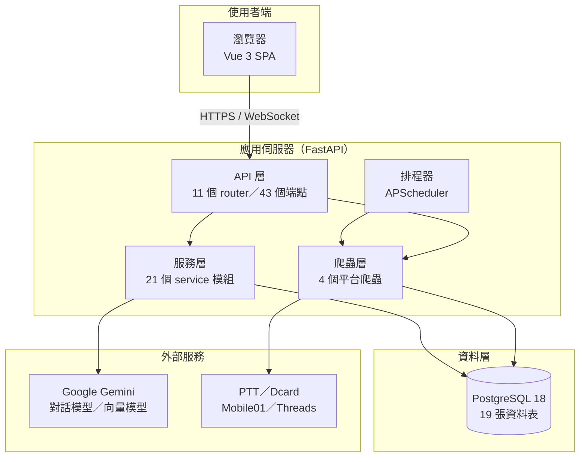
```mermaid
flowchart TB
    subgraph CLIENT["使用者端"]
        BROWSER["瀏覽器<br/>Vue 3 SPA"]
    end

    subgraph SERVER["應用伺服器（FastAPI）"]
        API["API 層<br/>11 個 router／43 個端點"]
        SVC["服務層<br/>21 個 service 模組"]
        CRAWL["爬蟲層<br/>4 個平台爬蟲"]
        SCHED["排程器<br/>APScheduler"]
    end

    subgraph DATA["資料層"]
        PG[("PostgreSQL 18<br/>19 張資料表")]
    end

    subgraph EXT["外部服務"]
        GEMINI["Google Gemini<br/>對話模型／向量模型"]
        SITES["PTT／Dcard<br/>Mobile01／Threads"]
    end

    BROWSER -- "HTTPS / WebSocket" --> API
    API --> SVC
    SVC --> PG
    SVC --> GEMINI
    SCHED --> CRAWL
    API --> CRAWL
    CRAWL --> SITES
    CRAWL --> PG
```

**反爬蟲的處理方式**：四個平台的取得難度不同，因此採用兩種策略。

| 平台 | 阻擋機制 | 因應方式 |
| --- | --- | --- |
| PTT | 無（僅需 over18 cookie） | `requests` + BeautifulSoup |
| Dcard | Cloudflare 阻擋無頭瀏覽器 | Playwright 真實瀏覽器 + 攔截 API 回應 |
| Mobile01 | Akamai 依 TLS 指紋阻擋一般 HTTP 請求（回 403） | Playwright 真實瀏覽器 |
| Threads | 內容由 JavaScript 動態渲染 | Playwright 真實瀏覽器 |

**圖 3-2　資料處理管線**


```mermaid
flowchart LR
    A["取得原始資料"] --> B["相關性過濾"]
    B --> C["寫入資料庫<br/>unique_id 去重"]
    C --> D["Gemini 情緒評分<br/>文章與留言"]
    D --> E["切段產生語意向量"]
    E --> F["關鍵字監測<br/>與預警判斷"]
```

相關性過濾在**寫入資料庫之前**執行：PTT 採看板加權，Dcard／Mobile01／Threads 因內容較生活化，改採關鍵字門檻（標題命中權重 3、內文權重 1，需達 2 分）。此設計使資料庫不被無關文章污染，後續分析的輸入較乾淨。

## 3-2　系統軟、硬體需求與技術平台

**表 3-1　軟硬體需求**

| 類別 | 項目 | 規格／版本 |
| --- | --- | --- |
| 開發環境 | 作業系統 | Windows 11 |
| | 後端語言 | Python 3.14.4 |
| | 前端執行環境 | Node.js 24.15.0 |
| 後端框架 | Web 框架 | FastAPI 0.136.1 |
| | ASGI 伺服器 | uvicorn 0.46.0 |
| | ORM | SQLAlchemy 2.0.49 |
| | 資料驗證 | Pydantic 2.13.4 |
| | 資料庫遷移 | Alembic 1.19.2 |
| | 排程 | APScheduler 3.11.2 |
| 前端框架 | 框架 | Vue 3.5.32（Composition API） |
| | 建置工具 | Vite 8.0.10 |
| | HTTP 用戶端 | Axios 1.16.0 |
| | 圖表 | Chart.js 4.5.1 |
| | 路由 | Vue Router 5.0.6 |
| 資料庫 | RDBMS | PostgreSQL 18.3 |
| | 擴充套件 | pg_trgm 1.6（中文模糊搜尋索引） |
| 爬蟲 | HTTP | requests 2.33.1 |
| | HTML 解析 | BeautifulSoup 4.14.3 |
| | 瀏覽器自動化 | Playwright 1.56.0（Chromium） |
| AI 服務 | SDK | google-genai 2.3.0 |
| | 對話模型 | gemini-2.5-flash-lite |
| | 向量模型 | gemini-embedding-001（768 維） |
| | 數值運算 | NumPy 2.3.4 |
| 硬體 | 開發機 | 一般個人電腦即可；Playwright 需可開啟視窗之環境 |
| | 伺服器 | 1 vCPU／512MB RAM 以上；無頭環境需關閉瀏覽器型爬蟲 |

## 3-3　使用標準與工具

**表 3-2　使用標準與工具**

| 類別 | 工具／標準 | 用途 |
| --- | --- | --- |
| 分析設計 | UML | 使用個案圖、活動圖、類別圖、循序圖、佈署圖、元件圖、狀態機 |
| 版本控制 | Git／GitHub | 原始碼管理，共 124 次 commit |
| 持續整合 | GitHub Actions | 每次推送自動執行測試、程式碼檢查與套件弱點掃描 |
| 後端測試 | pytest | 396 個測試案例 |
| 前端測試 | Vitest | 元件與畫面邏輯測試 |
| 程式碼檢查 | ruff（Python）、ESLint（JavaScript） | 統一風格與靜態檢查 |
| 資安檢查 | pip-audit | 相依套件已知漏洞掃描 |
| 資料庫遷移 | Alembic | 結構變更版本化，共 5 個 migration |
| 容器化 | Docker | 部署封裝 |
| API 文件 | OpenAPI／Swagger UI | FastAPI 自動產生，路徑 `/docs` |

---

# 第 4 章　專案時程與組織分工

## 4-1　專案時程

**表 4-1　專案時程**

> 下表「實際完成」欄位可依 Git 版本紀錄填寫（首次 commit 115/05/10，最近 commit 115/09/22，共 124 次）。
> 各階段起訖日期請依實際情形調整，並據此重繪甘特圖。

| 階段 | 工作項目 | 預計期間 | 實際完成 |
| --- | --- | --- | --- |
| 一 | 主題確立、文獻與競品調查 | （待填） | （待填） |
| 二 | 系統分析與 UML 設計 | （待填） | （待填） |
| 三 | 資料庫設計與建置 | （待填） | （待填） |
| 四 | PTT 爬蟲與基礎架構 | （待填） | （待填） |
| 五 | Dcard／Mobile01／Threads 爬蟲 | （待填） | （待填） |
| 六 | Gemini 情緒分析整合 | （待填） | （待填） |
| 七 | 儀表板與前端介面 | （待填） | （待填） |
| 八 | 帳號、權限與資安強化 | （待填） | （待填） |
| 九 | RAG 問答與語意檢索 | （待填） | （待填） |
| 十 | 測試、文件與部署 | （待填） | （待填） |

甘特圖（請依實際日期調整；繳交時建議另以 Microsoft Project 或 Visio 重繪）：

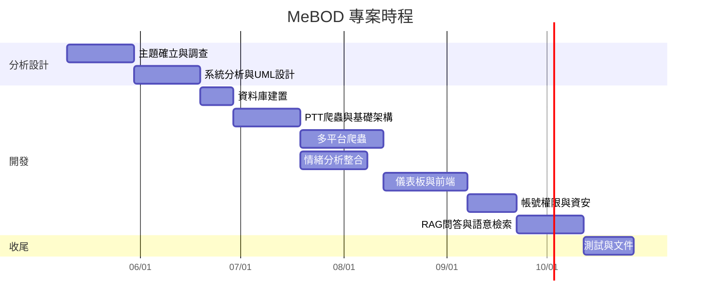
```mermaid
gantt
    title MeBOD 專案時程
    dateFormat YYYY-MM-DD
    axisFormat %m/%d
    section 分析設計
    主題確立與調查     :a1, 2026-05-10, 20d
    系統分析與UML設計  :a2, after a1, 20d
    section 開發
    資料庫建置         :b1, after a2, 10d
    PTT爬蟲與基礎架構  :b2, after b1, 20d
    多平台爬蟲         :b3, after b2, 25d
    情緒分析整合       :b4, after b2, 20d
    儀表板與前端       :b5, after b3, 25d
    帳號權限與資安     :b6, after b5, 15d
    RAG問答與語意檢索  :b7, after b6, 20d
    section 收尾
    測試與文件         :c1, after b7, 15d
```

## 4-2　專案組織與分工

**表 4-2　專案組織與分工**

> ● 主要負責人　〇 次要負責人（每項僅一位主要負責人，次要負責人至多兩位）

| 項目／組員 | （學號姓名） | （學號姓名） | （學號姓名） | （學號姓名） |
| --- | --- | --- | --- | --- |
| **後端開發** | | | | |
| 資料庫建置 | | | | |
| 伺服器架設 | | | | |
| 爬蟲開發（四平台） | | | | |
| 情緒分析與 RAG | | | | |
| 帳號與權限 | | | | |
| **前端開發** | | | | |
| 儀表板 | | | | |
| 問答與報表 | | | | |
| 後台管理 | | | | |
| **美術設計** | | | | |
| UI／UX | | | | |
| 色彩與 Logo | | | | |
| **文件撰寫** | | | | |
| 第 1～4 章 | | | | |
| 第 5～8 章 | | | | |
| 第 9～12 章 | | | | |
| 報告簡報 | | | | |

**表 4-3　工作內容與貢獻度**（加總 100%）

| 序號 | 姓名 | 工作內容（100 字以內） | 貢獻度 |
| --- | --- | --- | --- |
| 1 | （組長） | （待填） | ％ |
| 2 | （組員） | （待填） | ％ |
| 3 | （組員） | （待填） | ％ |
| 4 | （組員） | （待填） | ％ |
| | | **總計** | **100%** |

## 4-3　上傳 GitHub 紀錄

專案倉庫：`https://github.com/xujiaquan05/115405`

截至 115 年 9 月 22 日，主分支共 **124 次 commit**，期間為 115 年 5 月 10 日至 9 月 22 日。

> 請各組員自行擷取個人的 GitHub 貢獻紀錄畫面，依系上範例格式編號：
> 圖 4-3-1　（學號　姓名）上傳 GitHub 紀錄
> 圖 4-3-2　（學號　姓名）上傳 GitHub 紀錄
> （依組員人數依序增列）

---

# 第 5 章　需求模型

## 5-1　使用者需求

### 5-1-1　功能需求

**表 5-1　功能需求清單**

| 編號 | 需求名稱 | 說明 |
| --- | --- | --- |
| FR-01 | 帳號登入 | 使用者以帳號密碼登入，取得對應角色權限 |
| FR-02 | 訪客瀏覽 | 未登入者可瀏覽儀表板，但無法使用個人化功能 |
| FR-03 | 密碼變更 | 使用者可自行變更密碼，變更後既有登入階段失效 |
| FR-04 | 輿情儀表板 | 顯示聲量趨勢、情緒分佈、來源平台佔比與熱門文章 |
| FR-05 | 條件篩選 | 依關鍵字、時間範圍、平台與看板篩選儀表板資料 |
| FR-06 | 文章檢視 | 檢視單篇文章內容、留言與情緒評分 |
| FR-07 | 輿情問答 | 以自然語言提問，系統檢索相關文章後生成回答並附來源 |
| FR-08 | 關鍵字分析 | 針對指定關鍵字產生聲量、情緒與行銷洞察報告 |
| FR-09 | 分析歷史 | 保存個人的分析紀錄，可檢視與刪除 |
| FR-10 | 關鍵字監測 | 新增、啟用／停用、刪除監測關鍵字 |
| FR-11 | 主動預警 | 負面聲量超過門檻時自動產生警示，並可標記已讀 |
| FR-12 | 手動爬取 | 管理員可指定平台與看板立即觸發爬取 |
| FR-13 | 自動爬取 | 每日定時自動執行；若當日未執行，啟動後自動補跑 |
| FR-14 | 爬取狀態 | 顯示爬取進度與歷史紀錄 |
| FR-15 | 報表匯出 | 將文章資料匯出為 Excel |
| FR-16 | 使用者管理 | 管理員可新增、停用、刪除使用者並指派角色與方案 |
| FR-17 | 看板管理 | 管理員可新增看板、設定顯示名稱與啟用狀態 |
| FR-18 | 系統設定 | 管理員可調整爬取時間、頁數、預警門檻與各平台開關 |
| FR-19 | 稽核紀錄 | 記錄登入失敗、密碼變更、觸發爬取等敏感操作 |

### 5-1-2　非功能需求

**表 5-2　非功能需求清單**

| 編號 | 類別 | 需求內容 | 實作方式與實測值 |
| --- | --- | --- | --- |
| NFR-01 | 效能 | 儀表板查詢應快速回應 | 以 pg_trgm GIN 索引支援中文模糊搜尋 |
| NFR-02 | 效能 | 語意檢索應於 2 秒內回應 | 全庫 9,852 篇候選實測 1.7 秒，其中餘弦相似度計算僅 36 毫秒 |
| NFR-03 | 安全 | 密碼不得以明文儲存 | PBKDF2-HMAC-SHA256，600,000 次迭代，登入時漸進式重新雜湊 |
| NFR-04 | 安全 | 權杖不得被前端 JavaScript 讀取 | httpOnly + SameSite=strict Cookie |
| NFR-05 | 安全 | 變更密碼後舊權杖須失效 | 以 `password_changed_at` 與權杖簽發時間比對 |
| NFR-06 | 安全 | 須防止暴力破解 | 連續失敗 5 次鎖定帳號 15 分鐘，並寫入稽核紀錄 |
| NFR-07 | 安全 | 敏感操作須限管理員 | 爬取觸發、使用者管理、系統設定皆經 `require_admin` |
| NFR-08 | 安全 | 須防止 API 被濫用 | 以資料庫為共享狀態的固定視窗流量限制 |
| NFR-09 | 可靠 | 爬取不得重複執行 | 資料庫互斥鎖，含 TTL 與執行中續約機制 |
| NFR-10 | 可靠 | 服務關閉時進行中的爬取須可中止 | 停止旗標搭配可中斷延遲，1 秒內收手 |
| NFR-11 | 可靠 | 外部 AI 服務失效不得中斷服務 | 情緒評分、意圖解析、語意檢索皆有 fallback |
| NFR-12 | 隔離 | 使用者資料須彼此隔離 | 監測關鍵字、預警、分析歷史皆以 `user_id` 範圍化 |
| NFR-13 | 可維護 | 結構變更須版本化 | Alembic，5 個 migration |
| NFR-14 | 可維護 | 變更須有自動化驗證 | 396 個測試、GitHub Actions 持續整合 |
| NFR-15 | 隱私 | 不於留言內容儲存社群平台使用者代號 | PTT 推文僅保留標籤與內容，去除代號 |

## 5-2　使用個案圖

**圖 5-1　使用個案圖**

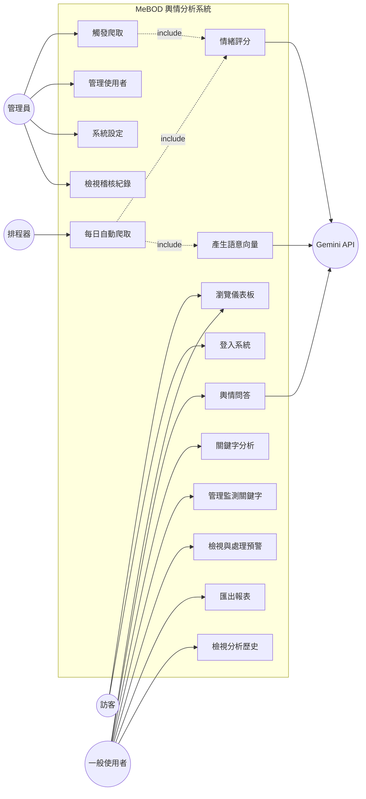
```mermaid
flowchart LR
    GUEST(("訪客"))
    USER(("一般使用者"))
    ADMIN(("管理員"))
    SCHED(("排程器"))
    GEMINI(("Gemini API"))

    subgraph SYS["MeBOD 輿情分析系統"]
        UC01["瀏覽儀表板"]
        UC02["登入系統"]
        UC03["輿情問答"]
        UC04["關鍵字分析"]
        UC05["管理監測關鍵字"]
        UC06["檢視與處理預警"]
        UC07["匯出報表"]
        UC08["檢視分析歷史"]
        UC09["觸發爬取"]
        UC10["管理使用者"]
        UC11["系統設定"]
        UC12["檢視稽核紀錄"]
        UC13["每日自動爬取"]
        UC14["情緒評分"]
        UC15["產生語意向量"]
    end

    GUEST --> UC01
    GUEST --> UC02
    USER --> UC01
    USER --> UC03
    USER --> UC04
    USER --> UC05
    USER --> UC06
    USER --> UC07
    USER --> UC08
    ADMIN --> UC09
    ADMIN --> UC10
    ADMIN --> UC11
    ADMIN --> UC12
    SCHED --> UC13
    UC13 -.include.-> UC14
    UC13 -.include.-> UC15
    UC09 -.include.-> UC14
    UC14 --> GEMINI
    UC15 --> GEMINI
    UC03 --> GEMINI
```

> 註：管理員繼承一般使用者的所有權限（`require_admin` 建立於 `get_current_user` 之上）。

## 5-3　使用個案描述（活動圖）

### 5-3-1　UC03　輿情問答

| 項目 | 內容 |
| --- | --- |
| 使用個案 | 輿情問答 |
| 參與者 | 一般使用者、Gemini API |
| 前置條件 | 已登入且方案額度未用罄 |
| 後置條件 | 產生回答與來源清單，並寫入快取 |
| 例外處理 | 意圖解析失敗改用規則式解析；語意檢索失敗改用純關鍵字檢索；生成失敗回傳保底回答 |

**圖 5-2　活動圖：輿情問答**

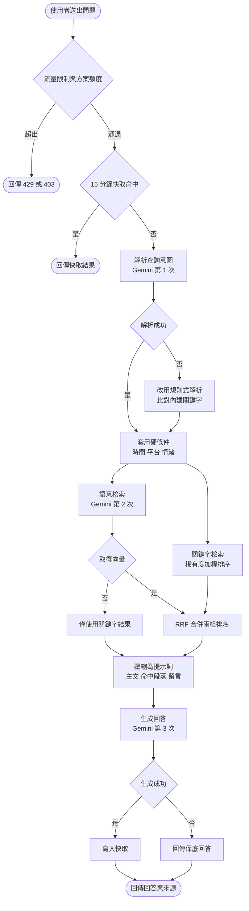
```mermaid
flowchart TD
    START([使用者送出問題]) --> RATE{流量限制與方案額度}
    RATE -- 超出 --> REJECT([回傳 429 或 403])
    RATE -- 通過 --> CACHE{15 分鐘快取命中}
    CACHE -- 是 --> RETURN([回傳快取結果])
    CACHE -- 否 --> INTENT["解析查詢意圖<br/>Gemini 第 1 次"]
    INTENT --> INTENTOK{解析成功}
    INTENTOK -- 否 --> FALLBACK["改用規則式解析<br/>比對內建關鍵字"]
    INTENTOK -- 是 --> FILTER["套用硬條件<br/>時間 平台 情緒"]
    FALLBACK --> FILTER
    FILTER --> KW["關鍵字檢索<br/>稀有度加權排序"]
    FILTER --> VEC["語意檢索<br/>Gemini 第 2 次"]
    VEC --> VECOK{取得向量}
    VECOK -- 否 --> KWONLY["僅使用關鍵字結果"]
    VECOK -- 是 --> FUSE["RRF 合併兩組排名"]
    KW --> FUSE
    KWONLY --> COMPRESS["壓縮為提示詞<br/>主文 命中段落 留言"]
    FUSE --> COMPRESS
    COMPRESS --> GEN["生成回答<br/>Gemini 第 3 次"]
    GEN --> GENOK{生成成功}
    GENOK -- 否 --> SAFE["回傳保底回答"]
    GENOK -- 是 --> SAVE["寫入快取"]
    SAVE --> RETURN2([回傳回答與來源])
    SAFE --> RETURN2
```

### 5-3-2　UC13　每日自動爬取

| 項目 | 內容 |
| --- | --- |
| 使用個案 | 每日自動爬取 |
| 參與者 | 排程器、外部社群平台、Gemini API |
| 前置條件 | 系統設定啟用自動爬取，且無其他爬取進行中 |
| 後置條件 | 新文章入庫並完成情緒評分與向量產生，必要時產生預警 |
| 例外處理 | 取鎖失敗即跳過；單一看板失敗不影響其他看板；系統關閉時中止並保留已寫入資料 |

**圖 5-3　活動圖：爬取與分析**

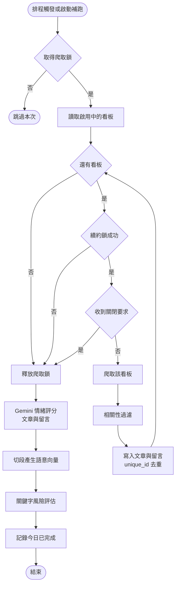
```mermaid
flowchart TD
    START([排程觸發或啟動補跑]) --> LOCK{取得爬取鎖}
    LOCK -- 否 --> SKIP([跳過本次])
    LOCK -- 是 --> TARGETS["讀取啟用中的看板"]
    TARGETS --> LOOP{還有看板}
    LOOP -- 否 --> RELEASE["釋放爬取鎖"]
    LOOP -- 是 --> RENEW{續約鎖成功}
    RENEW -- 否 --> RELEASE
    RENEW -- 是 --> STOP{收到關閉要求}
    STOP -- 是 --> RELEASE
    STOP -- 否 --> FETCH["爬取該看板"]
    FETCH --> REL["相關性過濾"]
    REL --> SAVE["寫入文章與留言<br/>unique_id 去重"]
    SAVE --> LOOP
    RELEASE --> SCORE["Gemini 情緒評分<br/>文章與留言"]
    SCORE --> EMBED["切段產生語意向量"]
    EMBED --> ALERT["關鍵字風險評估"]
    ALERT --> MARK["記錄今日已完成"]
    MARK --> END([結束])
```

## 5-4　分析類別圖

**圖 5-4　分析類別圖**

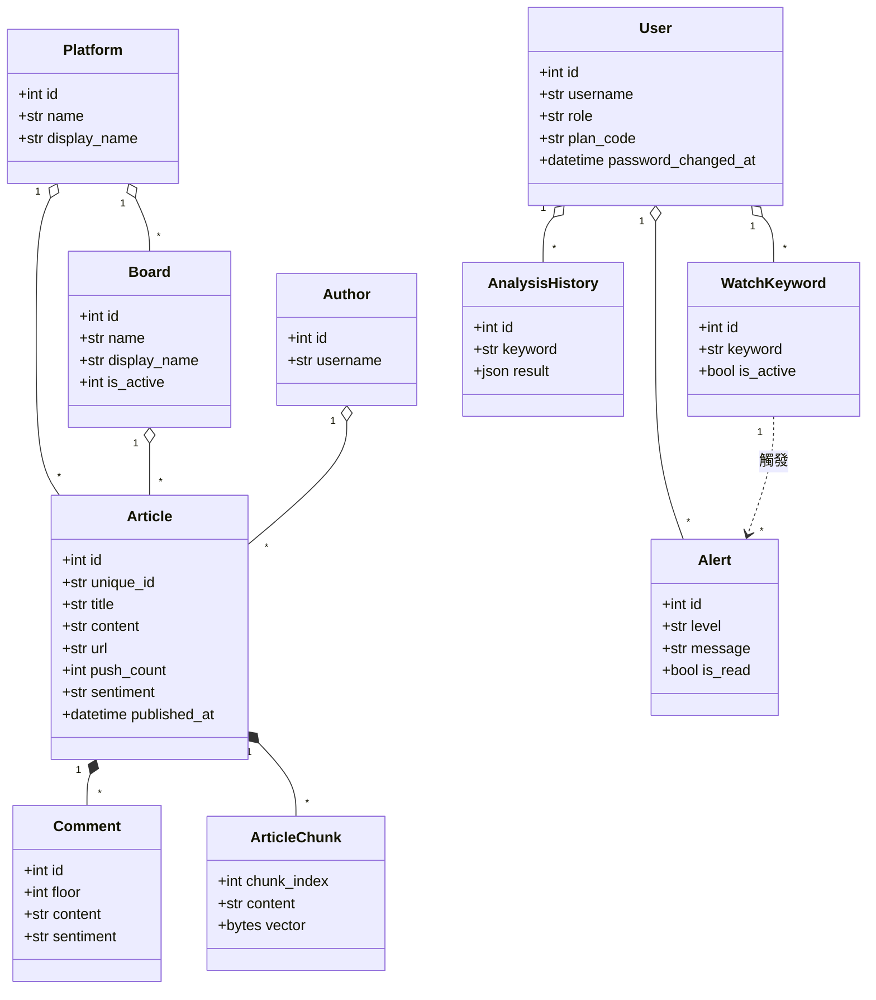
```mermaid
classDiagram
    class Platform {
        +int id
        +str name
        +str display_name
    }
    class Board {
        +int id
        +str name
        +str display_name
        +int is_active
    }
    class Author {
        +int id
        +str username
    }
    class Article {
        +int id
        +str unique_id
        +str title
        +str content
        +str url
        +int push_count
        +str sentiment
        +datetime published_at
    }
    class Comment {
        +int id
        +int floor
        +str content
        +str sentiment
    }
    class ArticleChunk {
        +int chunk_index
        +str content
        +bytes vector
    }
    class User {
        +int id
        +str username
        +str role
        +str plan_code
        +datetime password_changed_at
    }
    class WatchKeyword {
        +int id
        +str keyword
        +bool is_active
    }
    class Alert {
        +int id
        +str level
        +str message
        +bool is_read
    }
    class AnalysisHistory {
        +int id
        +str keyword
        +json result
    }

    Platform "1" o-- "*" Board
    Platform "1" o-- "*" Article
    Board "1" o-- "*" Article
    Author "1" o-- "*" Article
    Article "1" *-- "*" Comment
    Article "1" *-- "*" ArticleChunk
    User "1" o-- "*" WatchKeyword
    User "1" o-- "*" Alert
    User "1" o-- "*" AnalysisHistory
    WatchKeyword "1" ..> "*" Alert : 觸發
```

---

# 第 6 章　設計模型

## 6-1　循序圖

### 6-1-1　使用者登入

**圖 6-1　循序圖：使用者登入**

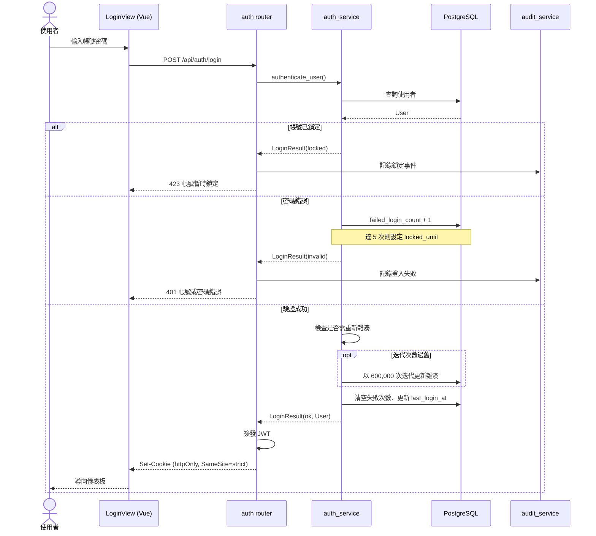
```mermaid
sequenceDiagram
    actor U as 使用者
    participant V as LoginView (Vue)
    participant R as auth router
    participant A as auth_service
    participant D as PostgreSQL
    participant AU as audit_service

    U->>V: 輸入帳號密碼
    V->>R: POST /api/auth/login
    R->>A: authenticate_user()
    A->>D: 查詢使用者
    D-->>A: User

    alt 帳號已鎖定
        A-->>R: LoginResult(locked)
        R->>AU: 記錄鎖定事件
        R-->>V: 423 帳號暫時鎖定
    else 密碼錯誤
        A->>D: failed_login_count + 1
        Note over A,D: 達 5 次則設定 locked_until
        A-->>R: LoginResult(invalid)
        R->>AU: 記錄登入失敗
        R-->>V: 401 帳號或密碼錯誤
    else 驗證成功
        A->>A: 檢查是否需重新雜湊
        opt 迭代次數過舊
            A->>D: 以 600,000 次迭代更新雜湊
        end
        A->>D: 清空失敗次數、更新 last_login_at
        A-->>R: LoginResult(ok, User)
        R->>R: 簽發 JWT
        R-->>V: Set-Cookie (httpOnly, SameSite=strict)
        V-->>U: 導向儀表板
    end
```

**設計說明**：

- **漸進式重新雜湊**：迭代次數提高後，既有帳號不需要求使用者重設密碼；在下次登入成功、已知明文的瞬間就地升級。
- **權杖失效**：JWT 的簽發時間（`iat`）與 `users.password_changed_at` 比對，變更密碼後舊權杖一律失效。此比較保留微秒精度——若兩邊都截到秒，同一秒內完成的變更會比不出先後，功能形同無效。

### 6-1-2　輿情問答（混合檢索）

**圖 6-2　循序圖：輿情問答**

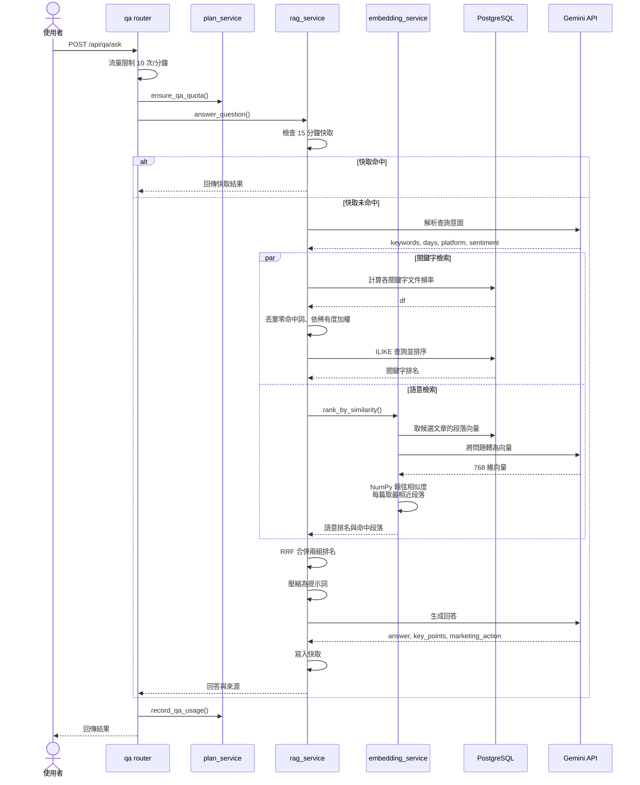
```mermaid
sequenceDiagram
    actor U as 使用者
    participant Q as qa router
    participant P as plan_service
    participant S as rag_service
    participant E as embedding_service
    participant D as PostgreSQL
    participant G as Gemini API

    U->>Q: POST /api/qa/ask
    Q->>Q: 流量限制 10 次/分鐘
    Q->>P: ensure_qa_quota()
    Q->>S: answer_question()

    S->>S: 檢查 15 分鐘快取
    alt 快取命中
        S-->>Q: 回傳快取結果
    else 快取未命中
        S->>G: 解析查詢意圖
        G-->>S: keywords, days, platform, sentiment

        par 關鍵字檢索
            S->>D: 計算各關鍵字文件頻率
            D-->>S: df
            S->>S: 丟棄零命中詞、依稀有度加權
            S->>D: ILIKE 查詢並排序
            D-->>S: 關鍵字排名
        and 語意檢索
            S->>E: rank_by_similarity()
            E->>D: 取候選文章的段落向量
            E->>G: 將問題轉為向量
            G-->>E: 768 維向量
            E->>E: NumPy 餘弦相似度<br/>每篇取最相近段落
            E-->>S: 語意排名與命中段落
        end

        S->>S: RRF 合併兩組排名
        S->>S: 壓縮為提示詞
        S->>G: 生成回答
        G-->>S: answer, key_points, marketing_action
        S->>S: 寫入快取
        S-->>Q: 回答與來源
    end
    Q->>P: record_qa_usage()
    Q-->>U: 回傳結果
```

**設計說明**：兩種檢索的盲點互補——關鍵字強在專有名詞（診所名、品牌名），語意強在換句話說。合併採 Reciprocal Rank Fusion（K=60），**只比名次不比原始分數**，因為推文數與餘弦相似度沒有共同量綱，直接相加沒有意義。

### 6-1-3　每日自動爬取

**圖 6-3　循序圖：每日自動爬取**

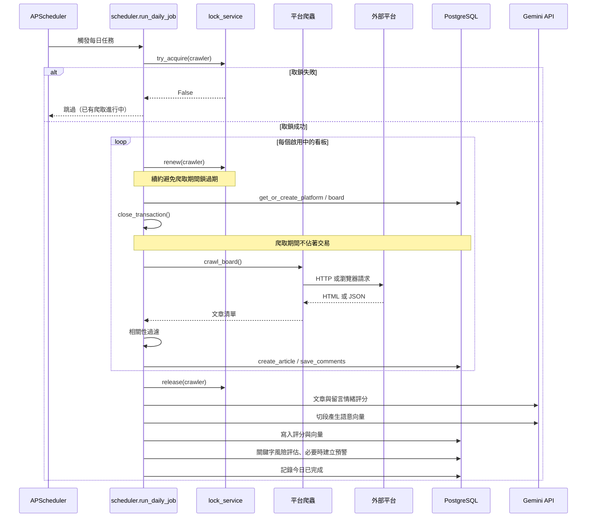
```mermaid
sequenceDiagram
    participant SC as APScheduler
    participant J as scheduler.run_daily_job
    participant L as lock_service
    participant C as 平台爬蟲
    participant W as 外部平台
    participant D as PostgreSQL
    participant G as Gemini API

    SC->>J: 觸發每日任務
    J->>L: try_acquire(crawler)
    alt 取鎖失敗
        L-->>J: False
        J-->>SC: 跳過（已有爬取進行中）
    else 取鎖成功
        loop 每個啟用中的看板
            J->>L: renew(crawler)
            Note over J,L: 續約避免爬取期間鎖過期
            J->>D: get_or_create_platform / board
            J->>J: close_transaction()
            Note over J,D: 爬取期間不佔著交易
            J->>C: crawl_board()
            C->>W: HTTP 或瀏覽器請求
            W-->>C: HTML 或 JSON
            C-->>J: 文章清單
            J->>J: 相關性過濾
            J->>D: create_article / save_comments
        end
        J->>L: release(crawler)
        J->>G: 文章與留言情緒評分
        J->>G: 切段產生語意向量
        J->>D: 寫入評分與向量
        J->>D: 關鍵字風險評估、必要時建立預警
        J->>D: 記錄今日已完成
    end
```

## 6-2　設計類別圖

**圖 6-4　設計類別圖**

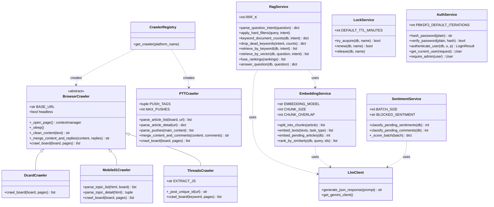
```mermaid
classDiagram
    class BrowserCrawler {
        <<abstract>>
        +str BASE_URL
        +bool headless
        +_open_page() contextmanager
        +_sleep()
        +_clean_content(text) str
        +_merge_content_and_replies(content, replies) str
        +crawl_board(board, pages)* list
    }
    class PTTCrawler {
        +tuple PUSH_TAGS
        +int MAX_PUSHES
        +parse_article_list(board, url) list
        +parse_article_detail(url) dict
        +parse_pushes(main_content) list
        +merge_content_and_comments(content, comments) str
        +crawl_board(board, pages) list
    }
    class DcardCrawler {
        +crawl_board(board, pages) list
    }
    class Mobile01Crawler {
        +parse_topic_list(html, board) list
        +parse_topic_detail(html) tuple
        +crawl_board(board, pages) list
    }
    class ThreadsCrawler {
        +str EXTRACT_JS
        +_post_unique_id(url) str
        +crawl_board(keyword, pages) list
    }
    class CrawlerRegistry {
        +get_crawler(platform_name)
    }

    class RagService {
        +int RRF_K
        +parse_question_intent(question) dict
        +apply_hard_filters(query, intent)
        +keyword_document_counts(db, intent) dict
        +drop_dead_keywords(intent, counts) dict
        +retrieve_by_keyword(db, intent) list
        +retrieve_by_vector(db, question, intent) list
        +fuse_rankings(rankings) list
        +answer_question(db, question) dict
    }
    class EmbeddingService {
        +str EMBEDDING_MODEL
        +int CHUNK_SIZE
        +int CHUNK_OVERLAP
        +split_into_chunks(article) list
        +embed_texts(texts, task_type) list
        +embed_pending_articles(db) int
        +rank_by_similarity(db, query, ids) list
    }
    class SentimentService {
        +int BATCH_SIZE
        +str BLOCKED_SENTIMENT
        +classify_pending_sentiments(db) int
        +classify_pending_comments(db) int
        +_score_batch(batch) dict
    }
    class LockService {
        +int DEFAULT_TTL_MINUTES
        +try_acquire(db, name) bool
        +renew(db, name) bool
        +release(db, name)
    }
    class AuthService {
        +int PBKDF2_DEFAULT_ITERATIONS
        +hash_password(plain) str
        +verify_password(plain, hash) bool
        +authenticate_user(db, u, p) LoginResult
        +get_current_user(request) User
        +require_admin(user) User
    }
    class LlmClient {
        +generate_json_response(prompt) str
        +get_gemini_client()
    }

    BrowserCrawler <|-- DcardCrawler
    BrowserCrawler <|-- Mobile01Crawler
    BrowserCrawler <|-- ThreadsCrawler
    CrawlerRegistry ..> PTTCrawler : creates
    CrawlerRegistry ..> BrowserCrawler : creates
    RagService ..> EmbeddingService : uses
    RagService ..> LlmClient : uses
    EmbeddingService ..> LlmClient : uses
    SentimentService ..> LlmClient : uses
```

**設計說明**：

- **爬蟲繼承結構**：Dcard、Mobile01、Threads 都需要真實瀏覽器，共用的啟動流程與文字處理抽到 `BrowserCrawler`；PTT 使用一般 HTTP 請求，故不繼承。各平台只需實作自己的解析邏輯。
- **註冊表模式**：`CrawlerRegistry` 依平台名稱回傳對應爬蟲，`crawler_router` 與 `scheduler` 共用同一套分派邏輯；新增平台只需在註冊表登記一處。
- **Gemini 呼叫集中於 `LlmClient`**：429 與 5xx 統一轉為 `LLMServiceUnavailableError`，呼叫端據此決定 fallback，而非各自判斷 HTTP 狀態碼。

---

# 第 7 章　實作模型

## 7-1　佈署圖

**圖 7-1　佈署圖**

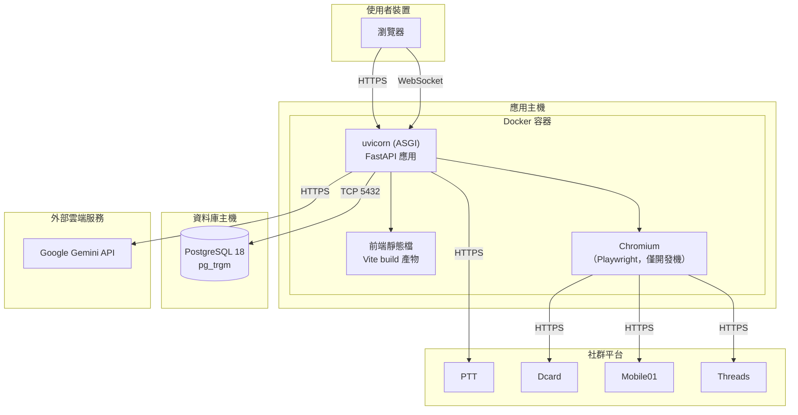
```mermaid
flowchart TB
    subgraph CLIENT["使用者裝置"]
        BROWSER["瀏覽器"]
    end

    subgraph HOST["應用主機"]
        subgraph DOCKER["Docker 容器"]
            UVICORN["uvicorn (ASGI)<br/>FastAPI 應用"]
            STATIC["前端靜態檔<br/>Vite build 產物"]
            CHROME["Chromium<br/>（Playwright，僅開發機）"]
        end
    end

    subgraph DB["資料庫主機"]
        PG[("PostgreSQL 18<br/>pg_trgm")]
    end

    subgraph CLOUD["外部雲端服務"]
        GEMINI["Google Gemini API"]
    end

    subgraph WEB["社群平台"]
        PTT["PTT"]
        DCARD["Dcard"]
        M01["Mobile01"]
        TH["Threads"]
    end

    BROWSER -- HTTPS --> UVICORN
    BROWSER -- WebSocket --> UVICORN
    UVICORN --> STATIC
    UVICORN -- TCP 5432 --> PG
    UVICORN -- HTTPS --> GEMINI
    UVICORN -- HTTPS --> PTT
    CHROME -- HTTPS --> DCARD
    CHROME -- HTTPS --> M01
    CHROME -- HTTPS --> TH
    UVICORN --> CHROME
```

**佈署說明**：容器啟動時先執行 `alembic upgrade head` 再啟動服務，確保資料庫結構與程式版本一致。部署至無頭環境時，於系統設定關閉 Dcard／Mobile01／Threads 爬取，僅保留 PTT，避免排程每日空跑並產生錯誤紀錄。

## 7-2　套件圖

**圖 7-2　套件圖**

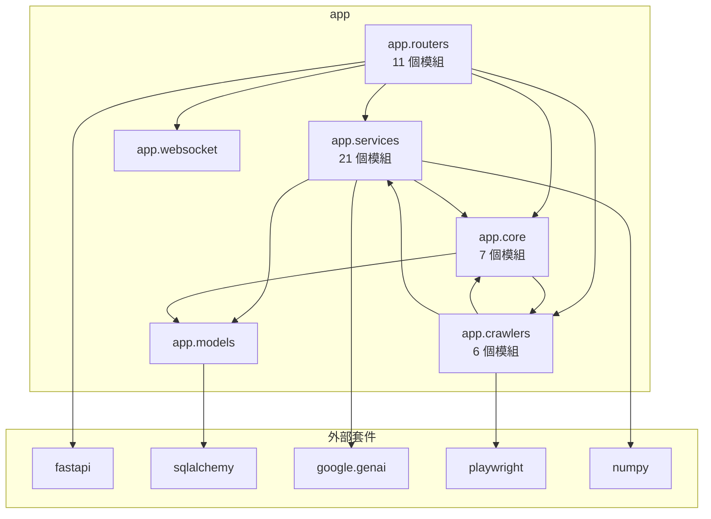
```mermaid
flowchart TB
    subgraph APP["app"]
        ROUTERS["app.routers<br/>11 個模組"]
        SERVICES["app.services<br/>21 個模組"]
        CRAWLERS["app.crawlers<br/>6 個模組"]
        CORE["app.core<br/>7 個模組"]
        MODELS["app.models"]
        WS["app.websocket"]
    end

    subgraph EXTERNAL["外部套件"]
        FASTAPI["fastapi"]
        SQLA["sqlalchemy"]
        GENAI["google.genai"]
        PW["playwright"]
        NP["numpy"]
    end

    ROUTERS --> SERVICES
    ROUTERS --> CORE
    ROUTERS --> CRAWLERS
    ROUTERS --> WS
    SERVICES --> MODELS
    SERVICES --> CORE
    CRAWLERS --> CORE
    CRAWLERS --> SERVICES
    CORE --> MODELS
    CORE --> CRAWLERS
    ROUTERS --> FASTAPI
    MODELS --> SQLA
    SERVICES --> GENAI
    SERVICES --> NP
    CRAWLERS --> PW
```

> 相依方向由上而下：router 依賴 service，service 依賴 model 與 core，不反向依賴。

## 7-3　元件圖

**圖 7-3　元件圖**

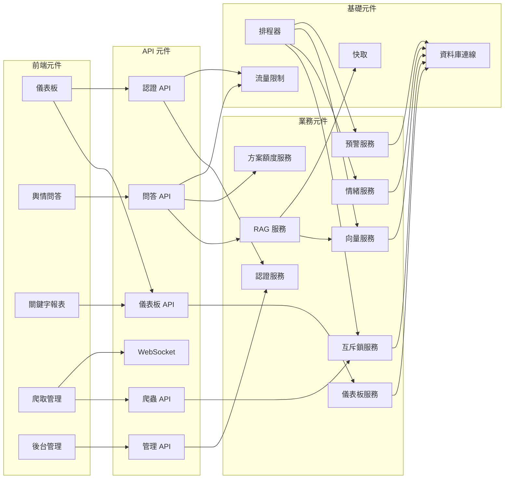
```mermaid
flowchart LR
    subgraph FE["前端元件"]
        DASH["儀表板"]
        QA["輿情問答"]
        REPORT["關鍵字報表"]
        CRAWLUI["爬取管理"]
        ADMINUI["後台管理"]
    end

    subgraph API["API 元件"]
        AUTHAPI["認證 API"]
        DASHAPI["儀表板 API"]
        QAAPI["問答 API"]
        CRAWLAPI["爬蟲 API"]
        ADMINAPI["管理 API"]
        WSAPI["WebSocket"]
    end

    subgraph BIZ["業務元件"]
        AUTHSVC["認證服務"]
        DASHSVC["儀表板服務"]
        RAGSVC["RAG 服務"]
        EMBSVC["向量服務"]
        SENTSVC["情緒服務"]
        ALERTSVC["預警服務"]
        LOCKSVC["互斥鎖服務"]
        PLANSVC["方案額度服務"]
    end

    subgraph INFRA["基礎元件"]
        DBC["資料庫連線"]
        SCHEDC["排程器"]
        RATEC["流量限制"]
        CACHEC["快取"]
    end

    DASH --> DASHAPI
    QA --> QAAPI
    REPORT --> DASHAPI
    CRAWLUI --> CRAWLAPI
    CRAWLUI --> WSAPI
    ADMINUI --> ADMINAPI
    DASH --> AUTHAPI

    AUTHAPI --> AUTHSVC
    DASHAPI --> DASHSVC
    QAAPI --> RAGSVC
    QAAPI --> PLANSVC
    CRAWLAPI --> LOCKSVC
    ADMINAPI --> AUTHSVC

    RAGSVC --> EMBSVC
    DASHSVC --> DBC
    RAGSVC --> CACHEC
    SENTSVC --> DBC
    EMBSVC --> DBC
    ALERTSVC --> DBC
    LOCKSVC --> DBC
    SCHEDC --> LOCKSVC
    SCHEDC --> SENTSVC
    SCHEDC --> EMBSVC
    SCHEDC --> ALERTSVC
    AUTHAPI --> RATEC
    QAAPI --> RATEC
```

## 7-4　狀態機

### 7-4-1　爬取鎖狀態機

爬取鎖是系統中最關鍵的並行控制機制。其狀態轉移設計解決了三個實際遇到的問題：多工作行程各持一份旗標、持鎖行程被強制關閉後鎖永久卡住、以及 TTL 短於爬取時間導致鎖在爬取中途過期。

**圖 7-4　狀態機：爬取鎖**

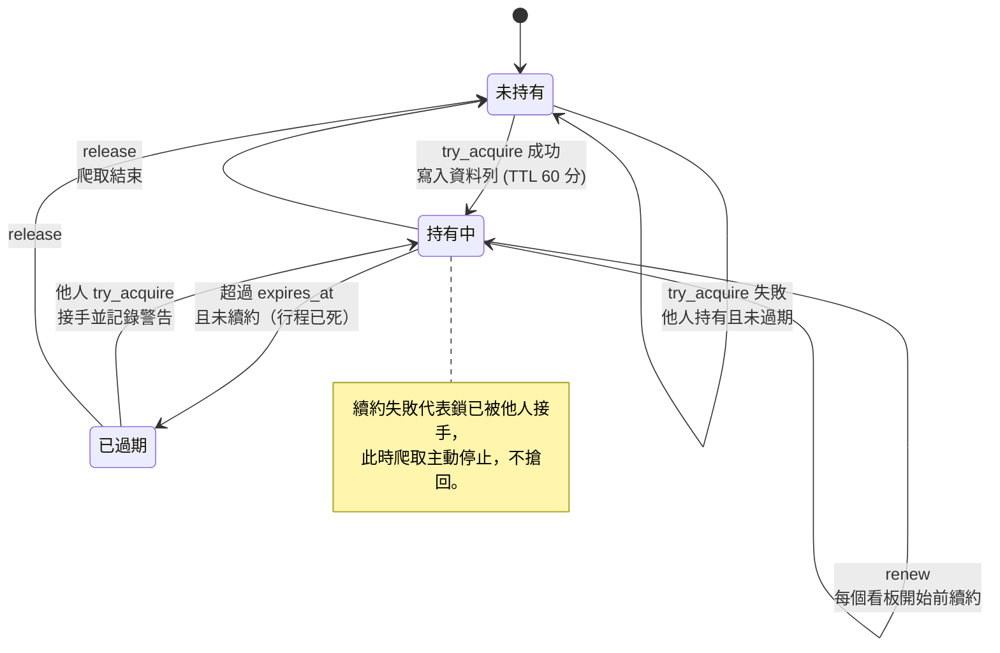
```mermaid
stateDiagram-v2
    [*] --> 未持有
    未持有 --> 持有中 : try_acquire 成功<br/>寫入資料列 (TTL 60 分)
    未持有 --> 未持有 : try_acquire 失敗<br/>他人持有且未過期

    持有中 --> 持有中 : renew<br/>每個看板開始前續約
    持有中 --> 未持有 : release<br/>爬取結束
    持有中 --> 已過期 : 超過 expires_at<br/>且未續約（行程已死）

    已過期 --> 持有中 : 他人 try_acquire<br/>接手並記錄警告
    已過期 --> 未持有 : release

    note right of 持有中
        續約失敗代表鎖已被他人接手，
        此時爬取主動停止，不搶回。
    end note
```

### 7-4-2　文章生命週期狀態機

**圖 7-5　狀態機：文章生命週期**

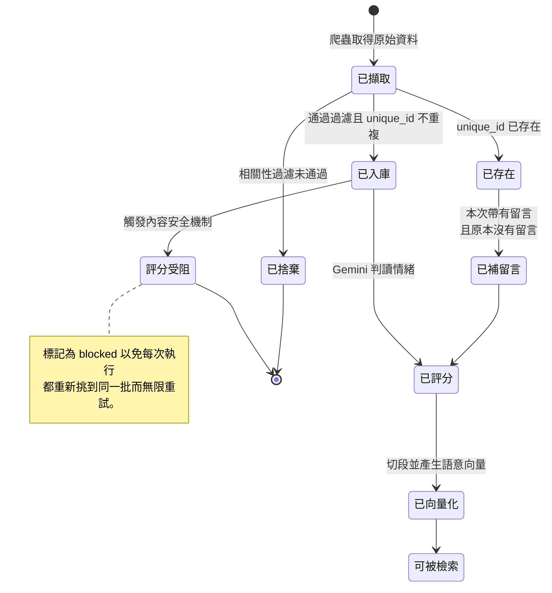
```mermaid
stateDiagram-v2
    [*] --> 已擷取 : 爬蟲取得原始資料
    已擷取 --> 已捨棄 : 相關性過濾未通過
    已擷取 --> 已入庫 : 通過過濾且 unique_id 不重複
    已擷取 --> 已存在 : unique_id 已存在

    已存在 --> 已補留言 : 本次帶有留言<br/>且原本沒有留言
    已補留言 --> 已評分

    已入庫 --> 已評分 : Gemini 判讀情緒
    已入庫 --> 評分受阻 : 觸發內容安全機制

    已評分 --> 已向量化 : 切段並產生語意向量
    已向量化 --> 可被檢索

    已捨棄 --> [*]
    評分受阻 --> [*]

    note right of 評分受阻
        標記為 blocked 以免每次執行
        都重新挑到同一批而無限重試。
    end note
```

---

# 第 8 章　資料庫設計

## 8-1　資料庫關聯圖

**圖 8-1　實體關聯圖**

> 實線代表資料庫中實際存在的外鍵約束。
> 唯一的虛線是 `WATCH_KEYWORDS` 與 `ALERTS`：兩者以關鍵字文字對應，並非外鍵關係。

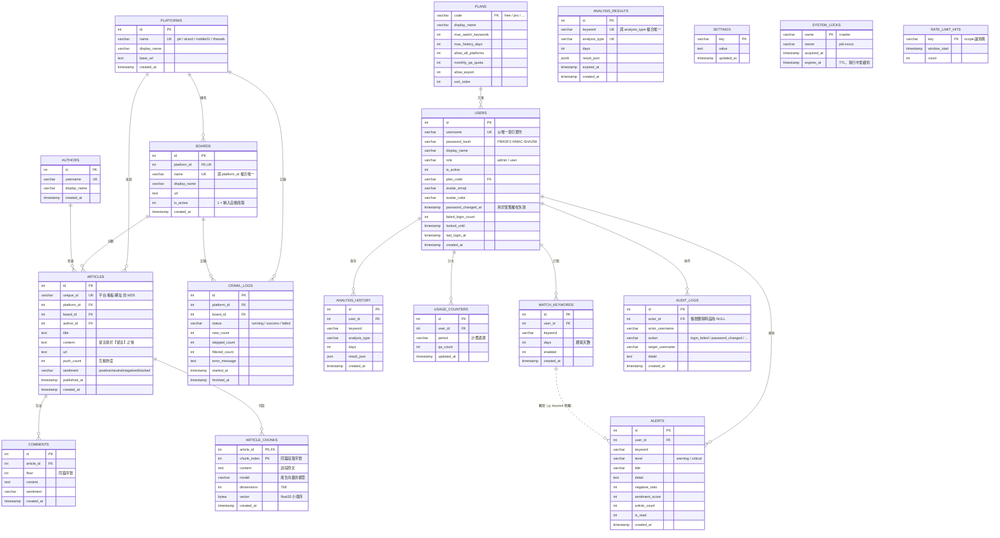
```mermaid
erDiagram
    PLATFORMS ||--o{ BOARDS : "擁有"
    PLATFORMS ||--o{ ARTICLES : "來源"
    PLATFORMS ||--o{ CRAWL_LOGS : "記錄"
    BOARDS    ||--o{ ARTICLES : "分類"
    BOARDS    ||--o{ CRAWL_LOGS : "記錄"
    AUTHORS   ||--o{ ARTICLES : "發表"
    ARTICLES  ||--o{ COMMENTS : "包含"
    ARTICLES  ||--o{ ARTICLE_CHUNKS : "切段"
    USERS     ||--o{ ANALYSIS_HISTORY : "保存"
    USERS     ||--o{ USAGE_COUNTERS : "計次"

    USERS     ||--o{ WATCH_KEYWORDS : "訂閱"
    USERS     ||--o{ ALERTS : "接收"
    USERS     ||--o{ AUDIT_LOGS : "操作"
    PLANS     ||--o{ USERS : "方案"
    WATCH_KEYWORDS ||..o{ ALERTS : "觸發（以 keyword 對應）"

    PLATFORMS {
        int id PK
        varchar name UK "ptt / dcard / mobile01 / threads"
        varchar display_name
        text base_url
        timestamp created_at
    }

    BOARDS {
        int id PK
        int platform_id FK, UK
        varchar name UK "與 platform_id 複合唯一"
        varchar display_name
        text url
        int is_active "1 = 納入自動爬取"
        timestamp created_at
    }

    AUTHORS {
        int id PK
        varchar username UK
        varchar display_name
        timestamp created_at
    }

    ARTICLES {
        int id PK
        varchar unique_id UK "平台:看板:網址 的 MD5"
        int platform_id FK
        int board_id FK
        int author_id FK
        text title
        text content "留言接於【留言】之後"
        text url
        int push_count "互動熱度"
        varchar sentiment "positive/neutral/negative/blocked"
        timestamp published_at
        timestamp created_at
    }

    COMMENTS {
        int id PK
        int article_id FK
        int floor "同篇序號"
        text content
        varchar sentiment
        timestamp created_at
    }

    ARTICLE_CHUNKS {
        int article_id PK, FK
        int chunk_index PK "同篇段落序號"
        text content "該段原文"
        varchar model "產生向量的模型"
        int dimensions "768"
        bytea vector "float32 小端序"
        timestamp created_at
    }

    USERS {
        int id PK
        varchar username UK "以唯一索引實作"
        varchar password_hash "PBKDF2-HMAC-SHA256"
        varchar display_name
        varchar role "admin / user"
        int is_active
        varchar plan_code FK
        varchar avatar_emoji
        varchar avatar_color
        timestamp password_changed_at "用於使舊權杖失效"
        int failed_login_count
        timestamp locked_until
        timestamp last_login_at
        timestamp created_at
    }

    PLANS {
        varchar code PK "free / pro / ..."
        varchar display_name
        int max_watch_keywords
        int max_history_days
        int allow_all_platforms
        int monthly_qa_quota
        int allow_export
        int sort_order
    }

    USAGE_COUNTERS {
        int id PK
        int user_id FK
        varchar period "計費週期"
        int qa_count
        timestamp updated_at
    }

    WATCH_KEYWORDS {
        int id PK
        int user_id FK
        varchar keyword
        int days "觀察天數"
        int enabled
        timestamp created_at
    }

    ALERTS {
        int id PK
        int user_id FK
        varchar keyword
        varchar level "warning / critical"
        varchar title
        text detail
        int negative_ratio
        int sentiment_score
        int article_count
        int is_read
        timestamp created_at
    }

    ANALYSIS_HISTORY {
        int id PK
        int user_id FK
        varchar keyword
        varchar analysis_type
        int days
        json result_json
        timestamp created_at
    }

    ANALYSIS_RESULTS {
        int id PK
        varchar keyword UK "與 analysis_type 複合唯一"
        varchar analysis_type UK
        int days
        jsonb result_json
        timestamp expired_at
        timestamp created_at
    }

    CRAWL_LOGS {
        int id PK
        int platform_id FK
        int board_id FK
        varchar status "running / success / failed"
        int new_count
        int skipped_count
        int filtered_count
        text error_message
        timestamp started_at
        timestamp finished_at
    }

    AUDIT_LOGS {
        int id PK
        int actor_id FK "帳號刪除時設為 NULL"
        varchar actor_username
        varchar action "login_failed / password_changed / ..."
        varchar target_username
        text detail
        timestamp created_at
    }

    SETTINGS {
        varchar key PK
        text value
        timestamp updated_at
    }

    SYSTEM_LOCKS {
        varchar name PK "crawler"
        varchar owner "pid-xxxxx"
        timestamp acquired_at
        timestamp expires_at "TTL，執行中會續約"
    }

    RATE_LIMIT_HITS {
        varchar key PK "scope:識別碼"
        timestamp window_start
        int count
    }
```

### 參考關係與限制（Constraints）

| 子表.欄位 | 參考 | 刪除規則 | 設計理由 |
| --- | --- | --- | --- |
| `boards.platform_id` | `platforms.id` | CASCADE | 平台刪除時其看板無存在意義 |
| `articles.platform_id` | `platforms.id` | NO ACTION | 已蒐集的文章為歷史資料，不隨平台設定刪除而消失 |
| `articles.board_id` | `boards.id` | NO ACTION | 同上 |
| `articles.author_id` | `authors.id` | NO ACTION | 同上 |
| `comments.article_id` | `articles.id` | CASCADE | 留言依附於文章 |
| `article_chunks.article_id` | `articles.id` | CASCADE | 向量段落依附於文章，文章刪除後無用 |
| `crawl_logs.platform_id` | `platforms.id` | NO ACTION | 稽核性質的歷史紀錄 |
| `crawl_logs.board_id` | `boards.id` | NO ACTION | 同上 |
| `analysis_history.user_id` | `users.id` | CASCADE | 個人化資料隨帳號刪除 |
| `usage_counters.user_id` | `users.id` | CASCADE | 同上 |

| `watch_keywords.user_id` | `users.id` | CASCADE | 個人化設定隨帳號刪除 |
| `alerts.user_id` | `users.id` | CASCADE | 同上 |
| `audit_logs.actor_id` | `users.id` | SET NULL | **刻意不用 CASCADE**：帳號被刪除時正是最需要保留稽核紀錄的時候，`actor_username` 另存一份名稱，連結斷了仍可追查 |
| `users.plan_code` | `plans.code` | RESTRICT | 還有帳號在用的方案不可刪除；CASCADE 會連帶刪掉使用者，SET NULL 會讓帳號沒有方案 |

> **補充說明**：上表後四組外鍵原本只存在於 SQLAlchemy 模型，資料庫並未建立。
> 原因是這些欄位是在資料表已存在後以 `ALTER TABLE ... ADD COLUMN IF NOT EXISTS` 補上的——
> `ADD COLUMN` 只加欄位不建外鍵，而 `create_all` 只建立缺少的**資料表**，不會在既有資料表上補約束。
> 已於遷移 `e4f70c2a9d18` 補齊，補之前先確認資料庫中沒有孤兒列。

**唯一性限制**：

- `articles.unique_id`：以「平台:看板:網址」雜湊產生，是重複爬取時判斷文章是否已存在的依據。
- `article_chunks (article_id, chunk_index)`：複合主鍵，確保同一篇文章的同一段落不會重複寫入。
- `platforms.name`、`users.username`：唯一。

**索引設計**：

| 索引 | 對象 | 用途 |
| --- | --- | --- |
| `idx_articles_title_trgm` | `articles.title` | pg_trgm GIN，支援中文 `ILIKE '%詞%'` 查詢 |
| `idx_articles_content_trgm` | `articles.content` | 同上 |
| `ix_articles_sentiment` | `articles.sentiment` | 情緒分佈統計 |
| `ix_comments_article_id` | `comments.article_id` | 取得文章留言 |

> **設計取捨**：中文無空白分詞，PostgreSQL 內建的 `to_tsvector` 全文檢索無法正確切詞，因此改用 pg_trgm 三連字元索引。其限制是查詢詞需達 3 個字以上才能使用索引；兩字詞（如「音波」）仍為全表掃描，但在套用時間範圍後候選數已降至數百至一千餘篇，實測仍在百毫秒內完成。

## 8-2　表格及其 Meta data

**表 8-1　資料表一覽**

| 資料表 | 用途 | 欄位數 | 實際筆數 |
| --- | --- | --- | --- |
| `platforms` | 社群平台 | 5 | 4 |
| `boards` | 看板／關鍵字 | 7 | 23 |
| `authors` | 發文者 | 4 | 5,456 |
| `articles` | 文章主體 | 12 | 9,852 |
| `comments` | 留言／推文 | 6 | 1,944 |
| `article_chunks` | 語意向量段落 | 7 | 18,680 |
| `users` | 使用者帳號 | 14 | 3 |
| `plans` | 訂閱方案 | 8 | 3 |
| `usage_counters` | 用量計次 | 5 | 0 |
| `watch_keywords` | 監測關鍵字 | 6 | 3 |
| `alerts` | 預警紀錄 | 11 | 1 |
| `analysis_history` | 個人分析歷史 | 7 | 16 |
| `analysis_results` | LLM 分析結果快取 | 7 | 30 |
| `crawl_logs` | 爬取紀錄 | 10 | 52 |
| `audit_logs` | 稽核紀錄 | 7 | 10 |
| `settings` | 系統設定 | 3 | 7 |
| `system_locks` | 跨行程互斥鎖 | 4 | 0 |
| `rate_limit_hits` | 流量限制計數 | 3 | 2 |
| `alembic_version` | 遷移版本 | 1 | 1 |

**表 8-2　`articles` 資料表 Meta data**

| 欄位 | 型別 | Null | 預設值 | 說明 |
| --- | --- | --- | --- | --- |
| `id` | integer | NO | 自動遞增 | 主鍵 |
| `unique_id` | varchar(64) | NO | - | 去重鍵，平台:看板:網址的 MD5 |
| `platform_id` | integer | NO | - | 外鍵 → platforms |
| `board_id` | integer | YES | - | 外鍵 → boards |
| `author_id` | integer | YES | - | 外鍵 → authors |
| `title` | text | NO | - | 文章標題 |
| `content` | text | YES | - | 正文；留言接於「【留言】」段落之後 |
| `url` | text | YES | - | 原文連結 |
| `push_count` | integer | YES | 0 | 互動熱度（PTT 推文數／其他平台互動數） |
| `published_at` | timestamp | YES | - | 原文發表時間 |
| `created_at` | timestamp | YES | CURRENT_TIMESTAMP | 入庫時間 |
| `sentiment` | varchar(20) | YES | - | positive／neutral／negative／blocked；NULL 為未評分 |

**表 8-3　`article_chunks` 資料表 Meta data**

| 欄位 | 型別 | Null | 預設值 | 說明 |
| --- | --- | --- | --- | --- |
| `article_id` | integer | NO | - | 複合主鍵之一，外鍵 → articles（CASCADE） |
| `chunk_index` | integer | NO | - | 複合主鍵之一，同篇文章內的段落序號（0 起算） |
| `content` | text | NO | - | 該段落原文，命中後直接放入提示詞 |
| `model` | varchar(50) | NO | - | 產生此向量的模型名稱 |
| `dimensions` | integer | NO | - | 向量維度（768） |
| `vector` | bytea | NO | - | float32 小端序，長度為 dimensions × 4 bytes |
| `created_at` | timestamp | YES | now() | 產生時間 |

> **設計取捨**：本機 PostgreSQL 未安裝 pgvector 擴充，故以 bytea 儲存 float32 位元組，讀出後直接由 NumPy 解讀。實測全庫 9,702 段向量的精確餘弦計算僅需 36 毫秒，而查詢總時間 1.7 秒中絕大部分是「將問題轉為向量」的 API 呼叫——該成本與資料量無關。在此規模下，近似最近鄰索引能縮短的正是那 36 毫秒，因此精確計算既較快也較準確。日後若資料量成長至百萬級，改用 pgvector 僅需修改此欄位型別與查詢函式。

**表 8-4　`users` 資料表 Meta data**

| 欄位 | 型別 | Null | 預設值 | 說明 |
| --- | --- | --- | --- | --- |
| `id` | integer | NO | 自動遞增 | 主鍵 |
| `username` | varchar(100) | NO | - | 帳號，唯一 |
| `password_hash` | varchar(255) | NO | - | PBKDF2-HMAC-SHA256 雜湊，含迭代次數與鹽 |
| `display_name` | varchar(100) | YES | - | 顯示名稱 |
| `role` | varchar(20) | NO | - | admin／user |
| `is_active` | integer | NO | - | 是否啟用 |
| `created_at` | timestamp | YES | now() | 建立時間 |
| `last_login_at` | timestamp | YES | - | 最後登入時間 |
| `avatar_emoji` | varchar(16) | YES | - | 頭像圖示 |
| `avatar_color` | varchar(16) | YES | - | 頭像色碼 |
| `plan_code` | varchar(20) | YES | 'free' | 訂閱方案代碼 |
| `password_changed_at` | timestamp | YES | - | 密碼變更時間，用於使舊權杖失效（保留微秒精度） |
| `failed_login_count` | integer | YES | 0 | 連續登入失敗次數 |
| `locked_until` | timestamp | YES | - | 帳號鎖定至此時間 |

## 8-3　資料庫遷移

結構變更以 Alembic 版本化，目前共 5 個遷移：

| 版本 | 內容 |
| --- | --- |
| `1be0b46ce6df` | 基準結構（對應初始 init.sql） |
| `d9430ad00c30` | 新增 `system_locks`、`rate_limit_hits`（跨行程共享狀態） |
| `65ddfa4c7c98` | 將個人分析歷史自共用的 LLM 快取拆出 |
| `b7c2e1f40a93` | 新增 `article_embeddings`（每篇一個向量） |
| `c3e8a91d7b45` | 改為 `article_chunks`（每篇多段向量） |
| `e4f70c2a9d18` | 補上四組缺少的外鍵，並刪除 `analysis_results.user_id` 殘留欄位 |

> **注意事項**：Alembic 的 autogenerate 會一併產生與本次變更無關的既有差異（索引命名、JSONB 對 JSON 等），直接套用會影響不相干的結構。本專案的遷移皆為手動撰寫，且以 inspector 檢查資料表是否已存在——開發機以 `--reload` 執行時，啟動階段的 `create_all` 會搶先建立新表，遷移必須在兩種情況下都能安全執行。

---

# 第 9 章　程式

## 9-1　元件清單及其規格描述

後端程式碼共 10,075 行，依職責分為 API 層（`routers`）、業務層（`services`）、爬蟲層（`crawlers`）與基礎層（`core`）。

**表 9-1　後端模組清單**

| 套件 | 模組 | 規格描述 |
| --- | --- | --- |
| **core** | `database.py` | 資料庫連線與 Session 工廠；`close_transaction()` 供長時間不需資料庫的階段釋放連線 |
| | `startup.py` | 啟動初始化：建表、補欄位、建立索引與預設資料 |
| | `scheduler.py` | APScheduler 每日任務、啟動補跑、爬取流程主控 |
| | `shutdown.py` | 關閉旗標與可中斷延遲，使進行中的爬取能於 1 秒內收手 |
| | `rate_limit.py` | 以資料庫為共享狀態的固定視窗流量限制 |
| | `time_utils.py` | 台灣時區時間處理 |
| | `config.py` | 環境設定讀取 |
| **routers** | `auth.py` | 登入、登出、個人資料、變更密碼（5 端點） |
| | `dashboard.py` | 儀表板彙總資料與看板清單（2 端點） |
| | `analysis.py` | 關鍵字分析、情緒評分狀態、分析歷史（5 端點） |
| | `qa.py` | 輿情問答（1 端點） |
| | `articles.py` | 單篇文章詳情（1 端點） |
| | `monitor.py` | 監測關鍵字、預警、手動執行每日任務（9 端點） |
| | `crawler_router.py` | 四平台爬取觸發、狀態查詢、重設（6 端點，皆限管理員） |
| | `admin.py` | 使用者、看板、系統設定、稽核紀錄、系統總覽（12 端點） |
| | `export.py` | Excel 匯出（1 端點） |
| | `websocket.py` | 爬取進度即時推播（1 端點） |
| **services** | `auth_service.py` | 密碼雜湊與驗證、JWT 簽發與解析、權限相依函式 |
| | `password_policy.py` | 密碼強度規則與常見密碼黑名單 |
| | `audit_service.py` | 敏感操作稽核紀錄 |
| | `plan_service.py` | 訂閱方案額度檢查與計次 |
| | `article_service.py` | 文章與留言寫入、去重、平台看板取得或建立 |
| | `relevance_filter.py` | 寫入前的醫美相關性判斷（分平台策略） |
| | `sentiment_service.py` | Gemini 批次情緒評分；整批被擋時二分拆解重試 |
| | `embedding_service.py` | 文章切段、向量產生、餘弦相似度排序 |
| | `rag_service.py` | 意圖解析、混合檢索、RRF 合併、回答生成 |
| | `article_compressor.py` | 將檢索結果壓縮為提示詞（主文／命中段落／留言分別配額） |
| | `keyword_extractor.py` | 中文關鍵字抽取 |
| | `llm_client.py` | Gemini API 呼叫封裝；429 與 5xx 統一轉為可重試例外 |
| | `llm_prompts.py` | 提示詞樣板集中管理 |
| | `llm_analysis_service.py` | 關鍵字洞察報告生成 |
| | `dashboard_service.py` | 儀表板統計查詢、篩選條件正規化 |
| | `alert_service.py` | 負面聲量門檻判斷與預警建立 |
| | `settings_service.py` | 系統設定讀寫（資料庫優先、環境變數為預設） |
| | `lock_service.py` | 跨行程互斥鎖：取得、續約、釋放、逾時接手 |
| | `cache_service.py` | 記憶體快取（問答結果 15 分鐘） |
| | `crawl_log_service.py` | 爬取紀錄建立與收尾 |
| | `export_service.py` | Excel 產生 |
| **crawlers** | `registry.py` | 依平台名稱分派爬蟲 |
| | `browser_base.py` | Playwright 共用基底：分頁開啟、stealth 設定、文字清理 |
| | `ptt_crawler.py` | PTT 列表與內頁解析、推文擷取 |
| | `dcard_crawler.py` | Dcard（攔截前端 API 回應） |
| | `mobile01_crawler.py` | Mobile01 列表與內頁解析 |
| | `threads_crawler.py` | Threads 搜尋結果擷取 |

**表 9-2　前端頁面清單**

前端程式碼共 7,334 行，採 Vue 3 Composition API。

| 頁面元件 | 功能 |
| --- | --- |
| `LandingView.vue` | 系統介紹首頁 |
| `LoginView.vue` | 登入 |
| `DashboardView.vue` | 輿情儀表板：趨勢、情緒分佈、平台佔比、熱門文章 |
| `ArticleDetailView.vue` | 單篇文章與留言檢視 |
| `QAView.vue` | 輿情問答對話介面 |
| `ReportView.vue` | 關鍵字分析報表 |
| `HistoryView.vue` | 個人分析歷史 |
| `MonitorView.vue` | 監測關鍵字與預警 |
| `CrawlManagementView.vue` | 爬取觸發與進度（WebSocket 即時更新） |
| `AdminUsersView.vue` | 使用者管理 |
| `SystemAdminView.vue` | 系統設定與稽核紀錄 |
| `ProfileView.vue` | 個人資料與變更密碼 |

## 9-2　其他附屬元件

| 元件 | 用途 |
| --- | --- |
| `scripts/backfill_sentiment.py` | 為既有文章補上情緒評分；分批、可中斷續跑、額度用罄時自動停止 |
| `scripts/backfill_embeddings.py` | 為既有文章切段並產生語意向量；同上機制 |
| `scripts/compare_retrieval.py` | 比較關鍵字與語意檢索之實際差異，供驗證與展示 |
| `evaluation/` | 情緒分析評估：標註樣本、評估腳本與結果說明 |
| `alembic/` | 資料庫遷移腳本 |
| `.github/workflows/ci.yml` | 持續整合：測試、程式碼檢查、套件弱點掃描 |
| `Dockerfile` | 容器映像，啟動前執行資料庫遷移 |

---

# 第 10 章　測試模型

## 10-1　測試計畫

本專案採**自動化測試為主、手動驗證為輔**的策略，共 **396 個測試案例**，分佈於 39 個測試檔。測試於每次推送時由 GitHub Actions 自動執行。

**採用的測試方法**：

| 方法 | 適用對象 | 工具 |
| --- | --- | --- |
| 單元測試 | 解析邏輯、演算法、純函式 | pytest |
| 整合測試 | API 端點（含認證與權限） | pytest + FastAPI TestClient |
| 迴歸測試 | 已修復的缺陷 | pytest |
| 靜態檢查 | 程式碼風格與潛在錯誤 | ruff、ESLint |
| 相依套件弱點掃描 | 第三方套件已知漏洞 | pip-audit |
| 實機驗證 | 爬蟲選擇器、效能量測 | 對實際網站與資料庫量測 |

**測試資料策略**：所有測試使用 SQLite 記憶體資料庫，不接觸正式資料庫；外部 API（Gemini、社群平台）一律以替身取代，測試不會產生對外請求與 API 費用。

**迴歸測試原則**：每修復一個缺陷，先撰寫能重現該缺陷的測試，確認其失敗後再修正程式。本文件第 10-2 節列出的測試多數屬此類。

## 10-2　測試個案與測試結果

**表 10-1　測試個案與結果**（節錄主要項目；完整 396 項見原始碼 `tests/`）

| 測試檔 | 案例數 | 主要驗證項目 | 結果 |
| --- | --- | --- | --- |
| `test_vector_search.py` | 28 | 向量打包還原、文章切段與重疊、以最佳段落計分、RRF 合併、檢索降級 | 通過 |
| `test_ptt_crawler.py` | 24 | 列表與內頁解析、推文擷取與標籤保留、簽名檔切除、留言合併 | 通過 |
| `test_dcard_crawler.py` | 22 | API 回應解析、留言合併、看板別名 | 通過 |
| `test_password_security.py` | 21 | 密碼強度規則、常見密碼阻擋、漸進式重新雜湊、變更密碼後權杖失效 | 通過 |
| `test_admin_api.py` | 20 | 使用者管理、系統設定、稽核紀錄之權限與驗證 | 通過 |
| `test_rag_service.py` | 17 | 意圖解析、檢索過濾、快取鍵、重新生成 | 通過 |
| `test_sentiment_service.py` | 16 | 批次評分解析、整批被擋時二分拆解、額度用罄時停止 | 通過 |
| `test_auth_api.py` | 14 | 登入、登出、鎖定、Cookie 屬性 | 通過 |
| `test_lock_service.py` | 12 | 互斥、逾時接手、續約、非持有者不可續約 | 通過 |
| `test_crawler_api.py` | 12 | 爬取端點權限（一般使用者一律 403）、平台開關、無效看板阻擋 | 通過 |
| `test_comment_flow.py` | 12 | 留言寫入、重複呼叫不重複寫入、既有文章亦可補留言 | 通過 |
| `test_board_api.py` | 12 | 看板管理與跨平台同名看板處理 | 通過 |
| `test_rag_platform_and_comments.py` | 11 | 四平台皆可鎖定、留言進入提示詞、避免誤判平台 | 通過 |
| `test_plan_and_tenancy.py` | 11 | 方案額度、使用者資料隔離 | 通過 |
| `test_keyword_relevance.py` | 11 | 零命中詞剔除、稀有度加權、相關性門檻 | 通過 |
| `test_mobile01_crawler.py` | 11 | 列表解析、回覆數千分位、內頁留言 | 通過 |
| `test_crawl_abort.py` | 8 | 關閉時中止爬取、中止不視為看板失敗 | 通過 |
| `test_startup_catchup.py` | 7 | 當日已執行則不補跑、開關與自動爬取設定 | 通過 |
| `test_deployment_hardening.py` | 7 | 安全標頭、正式環境設定 | 通過 |
| `test_crawl_transaction_scope.py` | 3 | 爬取期間不佔用資料庫交易、失敗後 session 仍可用 | 通過 |
| 其他 19 個測試檔 | 121 | 儀表板統計、預警、快取、匯出、設定、時間處理等 | 通過 |
| **合計** | **396** | | **全數通過** |

## 10-3　效能量測結果

除功能測試外，另對關鍵路徑實際量測（量測日期 115 年 9 月 22 日，資料量 9,852 篇文章／18,680 段向量）：

| 項目 | 條件 | 實測值 |
| --- | --- | --- |
| 關鍵字檢索 | 180 天範圍（1,883 篇候選） | 79–89 ms |
| 關鍵字檢索 | 全庫（9,852 篇候選） | 584 ms |
| 語意檢索 | 180 天範圍 | 1,579 ms |
| 語意檢索 | 全庫 | 1,725 ms |
| ├ 餘弦相似度計算 | 9,702 段向量 | 36 ms |
| └ 問題轉向量（API） | — | 約 1,500 ms |
| 關鍵字文件頻率統計 | 30 天／180 天 | 68 ms／165 ms |

**量測結論**：語意檢索的時間幾乎全部來自「將問題轉為向量」的外部 API 呼叫，該成本與資料量無關；資料量成長 5.6 倍（1,883 → 9,852 篇），總時間僅增加 268 毫秒。

## 10-4　情緒分析準確度評估

以 100 篇文章樣本評估 Gemini 情緒判讀結果：

| 指標 | 數值 |
| --- | --- |
| 整體準確率 | 90.7% |
| 負面類別召回率 | 0.897 |
| 最常見錯誤型態 | 帶有抱怨語氣的提問被判為負面 |

> **限制說明**：本評估的標註由另一個語言模型閱讀全文後產生，**尚未經人工複核**，且 90.7% 係以 75 篇隨機子集計算。此數據僅供參考，不宜視為嚴格的人工標註基準。

## 10-5　檢索品質驗證

為驗證語意檢索確實補足關鍵字檢索的不足，設計對照實驗（可由 `scripts/compare_retrieval.py` 重現）：

**實驗一：關鍵字完全無字面命中**

問題「除皺針打了會有什麼副作用」，「除皺針」一詞在 9,852 篇文章中出現 0 次。

| 檢索方式 | 結果篇數 | 前三名 |
| --- | --- | --- |
| 關鍵字檢索 | **0 篇** | — |
| 語意檢索 | **12 篇** | 打完肉毒眼睛變小／針劑補全臉後表情僵硬／肉毒打完眼睛吊吊的 |

**實驗二：切段對長文的影響**

問題「外泌體是從哪裡來的，植物來源跟動物來源差在哪」，目標為一篇 6,774 字的長文，相關內容位於第 1,600 字左右。

| 文章表示法 | 相似度 | 排名 |
| --- | --- | --- |
| 切段後（命中的那一段） | 0.6970 | 第 3 名 |
| 切段前（整篇一個向量、僅取前 1,000 字） | 0.5904 | 掉出前 6 名 |

> 同一排名中其餘文章皆短於 1,000 字，其新舊表示法為同一段文字、分數不變，故此對照成立。
> 值得注意的是「外泌體」一詞本就位於前 1,000 字內——舊作法並非搆不到該主題，而是一個向量需代表 6,774 字的多個主題而被稀釋。

---

# 第 11 章　操作手冊

## 11-1　系統元件

| 元件 | 說明 |
| --- | --- |
| PostgreSQL 18 | 資料庫，需啟用 `pg_trgm` 擴充 |
| Python 3.14 環境 | 後端執行環境 |
| Node.js 24 | 前端建置環境（僅建置階段需要） |
| Chromium（Playwright） | Dcard／Mobile01／Threads 爬蟲所需 |
| Google Gemini API 金鑰 | 情緒分析、語意向量與問答生成 |

## 11-2　安裝步驟

**步驟 1：建立資料庫**

```sql
CREATE DATABASE medical_beauty_db;
CREATE EXTENSION IF NOT EXISTS pg_trgm;
```

**步驟 2：設定環境變數**

複製 `backend/.env.example` 為 `backend/.env` 並填入：

| 變數 | 說明 |
| --- | --- |
| `DATABASE_URL` | PostgreSQL 連線字串 |
| `GOOGLE_API_KEY` | Gemini API 金鑰 |
| `JWT_SECRET` | JWT 簽章密鑰，正式環境必須自行設定 |
| `APP_ENV` | `development` 或 `production` |

**步驟 3：安裝後端相依套件**

```bash
cd backend
python -m venv venv
venv\Scripts\activate
pip install -r requirements.txt
playwright install chromium
```

**步驟 4：建立資料庫結構**

```bash
alembic upgrade head
```

**步驟 5：建置前端**

```bash
cd frontend
npm install
npm run build
```

**步驟 6：啟動服務**

```bash
cd backend
venv\Scripts\python.exe -m uvicorn app.main:app --port 8000
```

開發模式可加上 `--reload`。啟動後 API 文件位於 `http://localhost:8000/docs`。

## 11-3　系統管理

### 11-3-1　初始帳號

系統初始化會建立預設管理員帳號。**首次登入後必須立即於「帳號資訊 → 修改密碼」變更密碼**；系統已將預設密碼列入黑名單，無法沿用。

### 11-3-2　系統設定項目

於「系統管理 → 系統設定」調整，變更後即時生效、不需重啟：

| 設定 | 預設值 | 說明 |
| --- | --- | --- |
| `auto_crawl_enabled` | 開啟 | 每日自動爬取總開關 |
| `auto_crawl_hour` | 3 | 每日執行時間（台灣時間） |
| `auto_crawl_pages` | 2 | 每個看板爬取頁數 |
| `startup_catchup_enabled` | 開啟 | 啟動時若當日尚未執行則補跑一次 |
| `dcard_crawl_enabled` | 開啟 | 無頭環境應關閉 |
| `mobile01_crawl_enabled` | 開啟 | 同上 |
| `threads_crawl_enabled` | 開啟 | 同上 |
| `alert_warning_negative` | 25 | 負面比例警示門檻（%） |
| `alert_critical_negative` | 40 | 負面比例嚴重門檻（%） |
| `alert_min_articles` | 5 | 觸發預警所需的最少文章數 |

### 11-3-3　資料維護作業

| 作業 | 指令 | 時機 |
| --- | --- | --- |
| 補情緒評分 | `python scripts/backfill_sentiment.py` | 匯入舊資料後 |
| 補語意向量 | `python scripts/backfill_embeddings.py` | 匯入舊資料或更換向量模型後 |
| 預覽作業量 | 加上 `--dry-run` | 執行前確認 API 呼叫次數 |
| 檢索品質驗證 | `python scripts/compare_retrieval.py` | 調整檢索邏輯後 |

### 11-3-4　常見狀況處理

| 現象 | 原因 | 處理方式 |
| --- | --- | --- |
| 前端顯示「請確認網路或 backend 狀態」 | 後端未啟動或未回應 | 確認 uvicorn 是否執行、8000 埠是否被佔用 |
| 日誌出現 `Taking over expired lock` | 前次持鎖的行程異常結束 | 正常的保護機制，無需處理 |
| 爬取回應「已有爬取進行中」 | 互斥鎖生效 | 等待前次完成，或於爬取管理頁重設 |
| 排程未執行 | 主機於排程時間未開機 | 啟用 `startup_catchup_enabled` |
| 無頭環境爬取失敗 | 無法開啟瀏覽器 | 於系統設定關閉三個瀏覽器型平台 |

---

# 第 12 章　使用手冊

## 12-1　畫面轉移圖

**圖 12-1　畫面轉移圖**

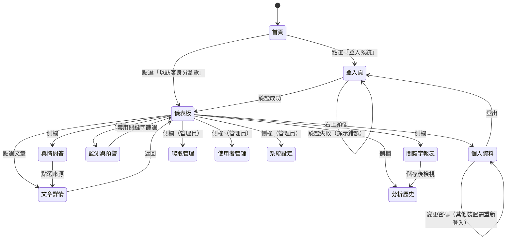
```mermaid
stateDiagram-v2
    [*] --> 首頁
    首頁 --> 登入頁 : 點選「登入系統」
    首頁 --> 儀表板 : 點選「以訪客身分瀏覽」

    登入頁 --> 儀表板 : 驗證成功
    登入頁 --> 登入頁 : 驗證失敗（顯示錯誤）

    儀表板 --> 文章詳情 : 點選文章
    文章詳情 --> 儀表板 : 返回
    儀表板 --> 輿情問答 : 側欄
    儀表板 --> 關鍵字報表 : 側欄
    儀表板 --> 監測與預警 : 側欄
    儀表板 --> 分析歷史 : 側欄
    儀表板 --> 個人資料 : 右上頭像

    輿情問答 --> 文章詳情 : 點選來源
    關鍵字報表 --> 分析歷史 : 儲存後檢視
    監測與預警 --> 儀表板 : 套用關鍵字篩選

    儀表板 --> 爬取管理 : 側欄（管理員）
    儀表板 --> 使用者管理 : 側欄（管理員）
    儀表板 --> 系統設定 : 側欄（管理員）

    個人資料 --> 登入頁 : 登出
    個人資料 --> 個人資料 : 變更密碼（其他裝置需重新登入）
```

## 12-2　各畫面操作說明

### 12-2-1　首頁

系統介紹頁，說明功能特色、運作流程與常見問答。提供兩個入口：「登入系統」與「以訪客身分瀏覽 Dashboard」。已登入時按鈕改為「進入 Dashboard」。

### 12-2-2　登入

輸入帳號與密碼後登入。連續輸入錯誤 5 次，帳號將鎖定 15 分鐘；此期間即使輸入正確密碼亦無法登入。

### 12-2-3　輿情儀表板

畫面分為四區：

1. **統計卡片**：文章總數、平均互動數、負面文章數。
2. **聲量趨勢**：每日文章數折線圖。
3. **情緒分佈**：正面／中性／負面圓餅圖。
4. **來源平台**：各平台佔比。
5. **熱門文章**：依互動數排序，點選進入詳情。

上方可依**關鍵字**、**時間範圍**與**平台／看板**篩選，所有圖表同步更新。

### 12-2-4　輿情問答

以自然語言提問，例如「最近大家對音波拉皮的評價如何」。系統回傳：

- **回答**：綜合檢索到的文章生成。
- **重點摘要**：條列式要點。
- **行銷建議**：給行銷人員的具體行動建議。
- **信心水準**：high／medium／low。
- **參考來源**：實際被引用的文章，可點選檢視原文。

相同問題於 15 分鐘內再次提問會回傳快取結果；可點選「重新生成」強制重新查詢。

### 12-2-5　關鍵字報表

輸入關鍵字後產生完整分析報告，包含聲量、情緒分佈、關鍵詞與洞察建議。報告會自動存入「分析歷史」。

### 12-2-6　監測與預警

新增欲長期追蹤的關鍵字，可隨時啟用或停用。當某關鍵字的負面比例超過設定門檻且文章數達下限時，系統自動產生預警。預警可標記為已讀。

### 12-2-7　爬取管理（管理員）

選擇平台與看板後觸發爬取，進度透過 WebSocket 即時顯示。頁面下方列出歷史爬取紀錄，含新增、略過與過濾篇數。

> **注意**：Dcard、Mobile01 與 Threads 會開啟瀏覽器視窗，屬正常現象，請勿關閉。

### 12-2-8　使用者管理（管理員）

新增使用者、指派角色（管理員／一般使用者）與訂閱方案、停用或刪除帳號。

### 12-2-9　系統設定（管理員）

調整爬取時間、頁數、預警門檻與各平台開關，並可檢視稽核紀錄（登入失敗、密碼變更、觸發爬取等）。

### 12-2-10　個人資料

檢視帳號資訊、變更顯示名稱與頭像、變更密碼。**變更密碼後，其他裝置上的登入階段會立即失效**，需重新登入。

---

# 第 13 章　感想

> 本章需由各組員自行撰寫，以下為可著墨的方向（撰寫後請刪除本提示）：
>
> - 開發過程中遇到最困難的技術問題及其解決方式。
> - 從「功能可以運作」到「功能可以信賴」之間的差距。
> - 分工協作與版本控制的實際經驗。
> - 對輿情分析、自然語言處理或系統設計的新認識。
> - 若重做一次，會採取哪些不同的做法。

（待填）

---

# 第 14 章　參考資料

> 以下為技術文件來源，市場與產業資料請由組員補充後併入本清單。

1. FastAPI Documentation. https://fastapi.tiangolo.com/
2. SQLAlchemy 2.0 Documentation. https://docs.sqlalchemy.org/
3. Vue.js 3 Documentation. https://vuejs.org/
4. PostgreSQL 18 Documentation — pg_trgm. https://www.postgresql.org/docs/current/pgtrgm.html
5. Google Gemini API Documentation. https://ai.google.dev/gemini-api/docs
6. Playwright for Python Documentation. https://playwright.dev/python/
7. Alembic Documentation. https://alembic.sqlalchemy.org/
8. Cormack, G. V., Clarke, C. L. A., & Buettcher, S. (2009). *Reciprocal Rank Fusion Outperforms Condorcet and Individual Rank Learning Methods.* SIGIR '09.
9. NIST SP 800-63B, *Digital Identity Guidelines: Authentication and Lifecycle Management.*（密碼儲存與迭代次數建議）
10. （待補）醫學美容產業市場報告
11. （待補）社群輿情分析相關文獻

---

# 附錄

## 附錄 A　審查評審意見之修正情形

> 初評及複評之評審建議事項均須填寫。

| 評審建議事項 | 修正情形 |
| --- | --- |
| （待填） | （待填） |
| （待填） | （待填） |

## 附錄 B　人工智慧使用說明

依系上規定，使用人工智慧或生成式人工智慧作為輔助作品產出工具者，須填寫下表。

**本專題之情形：☑ 使用人工智慧科技做為輔助作品產出之工具**

**表 附-1　AI 使用說明**

| 序號 | 使用工具名稱 | 使用範圍及說明 | 頁碼 |
| --- | --- | --- | --- |
| 1 | Google Gemini | **系統功能本身**：文章與留言情緒判讀、查詢意圖解析、語意向量產生、輿情問答回答生成 | 第 3、5、6 章 |
| 2 | Claude（Anthropic） | **開發輔助**：協助撰寫與重構後端程式、撰寫測試案例、效能問題診斷與最佳化、撰寫本系統手冊初稿 | 第 9、10 章 |
| 3 | （待填） | （如另有使用其他工具請自行增列） | |

> **說明**：
> 1. 序號 1 的 Gemini 屬於**系統的組成元件**，並非開發輔助工具——系統的情緒分析與問答功能即以其為核心，相關設計見第 3-1、5-3、6-1 節。
> 2. 序號 2 的 Claude 為**開發階段的輔助工具**。所有由其產出的程式碼均經組員檢視、實際執行與測試驗證後才納入專案；本手冊之各項數據亦皆由組員實際量測確認。
> 3. 請於專題內文中同步標示序號以利索引。

## 附錄 C　繳交清單檢核

依系上規定，複評通過後須上傳下列資料：

| 項目 | 狀態 |
| --- | --- |
| 簡報（PDF 檔） | （待製作） |
| 系統簡介（PDF 檔） | （待製作） |
| 系統手冊（PDF 或 Markdown 檔） | 本文件 |
| 物件導向系統分析與設計 VPP／VPD 檔 | （待以 Visual Paradigm 繪製） |
| 資料庫 MDF 與 LDF 檔 | （待匯出，註：本系統使用 PostgreSQL，需與指導老師確認繳交格式） |
| 所有軟體元件（元件、函式庫等） | `requirements.txt`、`package.json` 已列出 |
| 安裝程式（能完整安裝至 PC／NB 執行） | （待製作，可考慮以 Docker Compose 提供） |

> **提醒**：系上規定的資料庫繳交格式為 MDF／LDF，為 Microsoft SQL Server 的檔案格式。
> 本系統使用 PostgreSQL，請主動與指導老師確認可否改以 `pg_dump` 匯出檔繳交。
